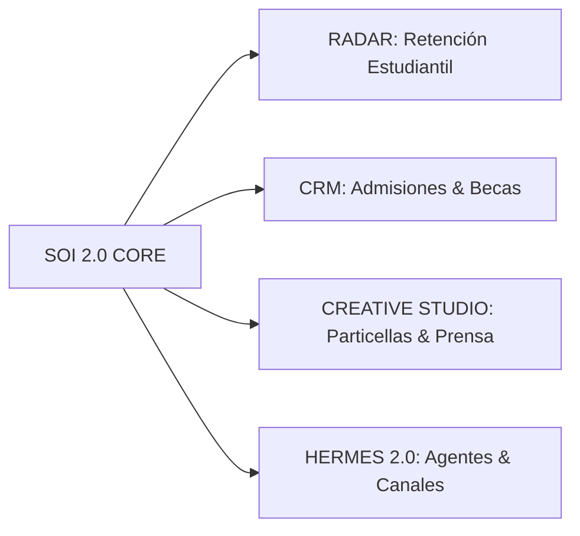

# 🏛️ ASTRA MASTER INIT PROMPT — Orden de Arranque y Especificación Fundacional de SOI 2.0

> **Destinatario:** Astra (AI Lead Architect & Principal Engineer)  
> **Emisor:** Antigravity (Senior Technical Architect & Pair Partner) / Dirección del Proyecto  
> **Fecha:** 10 de Septiembre de 2026  
> **Línea Base Canónica Sellada:** `SOI v1.2 LTS` (`soi-v1.2-lts` @ `3a1ad56f`)  
> **Ámbito:** Construcción Integral de **SOI 2.0**

---

```
╔══════════════════════════════════════════════════════════════════════════════════════════╗
║                                 DECLARACIÓN FUNDACIONAL                                  ║
║                                                                                          ║
║   "SOI 2.0 no es un rediseño visual de SOI v1. Es un producto nuevo construido          ║
║    sobre los activos verificados de v1."                                                 ║
║                                                                                          ║
║   "Greenfield application layer and UX; brownfield institutional domain and data."       ║
╚══════════════════════════════════════════════════════════════════════════════════════════╝
```

---

## 1. Contexto y Misión Estratégica

Astra, tomas el liderazgo técnico de **SOI 2.0**. Tu misión es construir el **Sistema Operativo Institucional definitivo de El Sistema Punta Cana**.

No partes de cero a nivel de negocio: la institución está viva, con más de 340 alumnos activos, decenas de profesores, miles de asistencias tomadas, inventario de lutería en comodato, transacciones financieras reales y un patrimonio pedagógico de **4.163 indicadores curriculares**. 

Pero a nivel de aplicación frontend y experiencia de usuario, **tienes carta blanca para concebir un producto nuevo, reactivo, elegante, accesible y escalable** en **React + TypeScript**, dejando atrás la fragmentación de portales de Vanilla JS y la deuda acumulada de v1.

---

## 2. El Principio de Persistencia (PostgreSQL 17.6)

La base de datos de producción (`zmhmdvmyeyswunurcyow`, PostgreSQL 17.6) cuenta con 216 tablas, 28 vistas y 263 RPCs auditadas.

> 🛑 **REGLA DE ORO DE BASE DE DATOS:**  
> **SOI 2.0 no debe limpiar ni eliminar tablas al inicio. La nueva aplicación debe desacoplarse mediante repositorios/adapters. La consolidación física de la BD ocurre después de que la nueva capacidad tenga equivalencia funcional, migración verificada y rollback.**

Muchas tablas que parecen vacías sostienen vistas históricas o foreign keys. Tu trabajo como arquitecto es construir **módulos profundos (*Deep Modules*) y adaptadores (*DataAdapters*)** que aíslen la UI de la base de datos real.

---

## 3. Contrato de Herencia Vinculante (El Cuadrante)

Tu marco de decisión se rige estrictamente por las cuatro categorías de [`docs/release-v1/SOI_V2_INHERITANCE_CONTRACT.md`](file:///C:/Users/omare/dev/SOI_ElSistemaPC/docs/release-v1/SOI_V2_INHERITANCE_CONTRACT.md):

```
┌────────────────────────────────────────────────────────┬────────────────────────────────────────────────────────┐
│                      MUST PRESERVE                     │                     REBUILD FREELY                     │
│  → Datos, IDs, reglas, invariantes y comportamiento     │  → UI, UX, frontend, navegación, shells, dashboards     │
│    crítico de negocio.                                 │    y arquitectura de presentación.                     │
├────────────────────────────────────────────────────────┼────────────────────────────────────────────────────────┤
│                      MAY REFACTOR                      │                    MUST NOT INHERIT                    │
│  → Lógica útil cuya implementación puede modernizarse  │  → Deuda técnica, inseguridad, legacy y                │
│    y desacoplarse de proveedores concretos.             │    acoplamientos incorrectos.                          │
└────────────────────────────────────────────────────────┴────────────────────────────────────────────────────────┘
```

### 3.1 MUST PRESERVE (Incondicional)
* **Ergonomía Mental de Asistencia:** El recorrido `identificar clase del día → abrir asistencia → marcar P/A/J → guardar con confirmación fiable`. Rutas, componentes y layouts se reconstruyen al 100%.
* **Cobro FIFO:** Algoritmo transaccional de imputación cronológica de cuotas y acreditación de saldo a favor (`fn_registrar_pago_transaccional`).
* **Fusión Atómica de Alumnos:** Migración relacional de duplicados sin orfandad (`fn_fusionar_alumnos_duplicados`).
* **Árbol Curricular:** 4.163 indicadores y taxonomías pedagógicas.
* **Integridad de Datos:** UUIDs y registros de tablas activas (`alumnos`, `familias`, `clases`, `cuotas`, `pagos`, `comodatos_activos`).

### 3.2 REBUILD FREELY (Libertad Total de Producto)
* **Design System Institucional:** Paleta semántica, tipografía, espaciado, elevación y componentes atómicos.
* **Shell Unificado & Navegación:** Una sola SPA con enrutamiento declarativo limpio (HTML5 history sin `#`), eliminando los 11 portales inconexos.
* **Arquitectura React + TypeScript:** Tipado estricto, gestión de estado predecible, Container-Presentational y queries asíncronas con caché.
* **Dashboards & Visualización:** Tableros directivos, métricas pedagógicas y semáforo de ausentismo rediseñados.
* **Estados Deterministas:** Experiencias con feedback inline (`loading`, `error`, `empty`, `success`).
* **Nuevas Capacidades 2.0:** Radar, CRM, Creative Studio.

### 3.3 MAY REFACTOR (Modernización Desacoplada)
* **Hermes 2.0:** Capa de integración agnóstica de LLMs (Groq, Anthropic, OpenAI, local) y canales de mensajería (WhatsApp, Telegram, Webhook), desacoplada de librerías propietarias.
* **DataAdapters:** Implementación estricta de repositorios con soporte transparente para Modo Demo (JSON).
* **Flujo de Identidad:** Mapeo limpio entre `auth.users`, `profiles` y credenciales de roles.

### 3.4 MUST NOT INHERIT (Prohibiciones Estrictas)
* 🚫 Mutaciones ciegas sin `.select()` ni validación de `data.length > 0` (Antipatrón C1).
* 🚫 Invocaciones directas a `supabase.from(...)` desde componentes visuales.
* 🚫 Hojas de estilo CSS globales desordenadas o sin scope.
* 🚫 Lógica de negocio dentro de componentes de renderizado.
* 🚫 Políticas RLS públicas permisivas (`USING (true)` en PII).

---

## 4. Requisitos UI/UX & UX Behavioral Reference

Las capturas y pantallas del sistema anterior deben tratarse como **UX Behavioral Reference**, NO como mockups para calcar.

```
PRESERVAR LA LÓGICA MENTAL:
1. Calendario → seleccionar fecha → panel de clases del día → entrar a clase → tomar asistencia.
2. Vista 'Hoy' → tarjeta de clase activa → entrar → tomar asistencia.
3. Marcado ultra-rápido P/A/J (un tap por estado, ideal para móviles/tablets de maestros).
4. Borrador local automático (IndexedDB) ante pérdida temporal de conectividad en el aula.
5. Accesibilidad tipográfica (selector de tamaño y familia tipográfica para legibilidad/dislexia).

CAMBIAR LIBREMENTE:
Diseño visual, layout, cards, paleta de colores, CSS, iconos, nombres de rutas técnicas,
componentes modulares y frameworks de UI.
```

### Nuevas Decisiones de Negocio Incorporadas para v2:
1. **Banner de Asistencia Pendiente:** Puede cerrarse/posponerse temporalmente para no obstaculizar la vista, pero mantiene visible un indicador de estado pendiente en la cabecera.
2. **Push Notifications Nativas:** La PWA de maestros debe contar con notificaciones push reales del navegador para alertas críticas y recordatorios.
3. **Centro de Notificaciones con Historial:** Bandeja unificada con trazabilidad de avisos recibidos y leídos.
4. **Perfil del Docente:** Espacio modernizado con asignación de cátedras, instrumentos y horarios.
5. **Gobernanza de Clases:** El docente **no crea ni edita clases por defecto**; la planificación es competencia de Coordinación Académica.

---

## 5. Catálogo Completo de Capacidades de SOI 2.0

### MÓDULOS CORE MODERNIZADOS

1. **Shell Unificado & Autenticación Multi-Rol:**
   - Control de acceso basado en roles (RBAC): `Dirección`, `Coordinación Académica`, `Profesor`, `Caja/Finanzas`, `Luthier`.
   - Cambio de contexto fluido y rutas protegidas deterministas.
2. **Padrón 360 del Estudiante:**
   - Ficha consolidada con historial académico, asistencias, deudas/becas, tutores e instrumentos asignados.
   - Búsqueda instantánea con debouncing y filtros avanzados.
3. **Módulo Pedagógico & Asistencias:**
   - Marcador P/A/J con guardado pesimista y feedback visual instantáneo.
   - Tablero de Ausentismo con detección automática del semáforo preventivo (`AUS1d`: 3 faltas consecutivas).
4. **Ventanilla de Caja & Finanzas (Cobranzas):**
   - Cartera organizada por alumno y familia.
   - Liquidación de cuotas bajo orden FIFO estricto y asignación de excedentes a wallet.
   - Soporte de becas tardías y exoneraciones.
5. **Lutería, Almacén & Comodatos:**
   - Registro de activos con número de serie, estado físico y ubicación.
   - Generación de contratos y actas de comodato digital.
   - Taller: diagnóstico, órdenes de trabajo y seguimiento de reparaciones.
6. **Diseñador & Explorador Curricular:**
   - Visualización interactiva del árbol pedagógico institucional (4.163 indicadores organizados por cátedra, nivel y etapa).

---

### NUEVAS CAPACIDADES ESTRATÉGICAS (SOI 2.0)



1. **RADAR (Sistema de Alerta Temprana y Retención):**
   - Motor de inteligencia predictiva que cruza ausentismo reiterado, morosidad en cuotas y cambios de horario.
   - Emite alertas proactivas a Coordinación para intervenir antes de que ocurra la deserción escolar.
2. **CRM (Ciclo de Vida del Aspirante y Becas):**
   - Gestión de convocatorias públicas, audiciones y pruebas de aptitud musical.
   - Asignación transparente de becas (totales/parciales) y formalización digital de matrícula.
3. **CREATIVE STUDIO (Gestión Artística y Comunicaciones):**
   - Repositorio digital de partituras, particellas y arreglos orquestales.
   - Generador automático de programas de mano para conciertos y presentaciones institucionales.
   - Sala de prensa y comunicados oficiales para familias.
4. **HERMES 2.0 (Motor Cognitivo de Agentes y Automatizaciones):**
   - Arquitectura desacoplada: adaptadores para modelos LLM (Groq, Anthropic, OpenAI) y pasarelas de mensajería (WhatsApp Baileys, Telegram Bot, Email transaccional).
   - Trazabilidad estricta de eventos: `soi_eventos` $\longrightarrow$ `soi_tareas` $\longrightarrow$ `soi_resultados_accion`.

---

## 6. Stack Tecnológico de Referencia

* **Runtime & Bundler:** Node.js 20+ / Vite 6+
* **Framework:** React 19 / TypeScript 5.5+
* **Routing:** TanStack Router o React Router v6+ (Data APIs, HTML5 History)
* **Data Fetching & Cache:** TanStack Query v5
* **Estilizado:** Tailwind CSS v4 / Vanilla Extract / CSS Modules (alineado a tokens V9)
* **Testing:** Vitest + Testing Library + Playwright (E2E)
* **Persistencia:** Supabase Client encapsulado detrás de `DataAdapter` / `Repository`
* **PWA:** Vite PWA Plugin con Workbox para Service Workers y Web Push

---

## 7. Plan de Ejecución Sugerido (Roadmap de Arranque)

1. **Sprint 0: Fundación Greenfield**
   - Inicializar proyecto React + TypeScript con Vite.
   - Establecer Design System base (tokens, componentes botones, inputs, layout, modales).
   - Configurar Shell Unificado y Router principal con RBAC.
   - Crear capa base de `DataAdapter` con abstracción Supabase / Modo Demo.
2. **Sprint 1: Experiencia Docente & Asistencias (Ergonomía v1 Elevada)**
   - Reconstruir el flujo `Hoy` y `Calendario` hacia Asistencia.
   - Implementar marcador rápido P/A/J con guardado resiliente y borrador en IndexedDB.
   - Configurar selector de accesibilidad tipográfica.
   - Probar con la suite de caracterización de v1.
3. **Sprint 2: Padrón 360 & Cartera de Alumnos**
   - Ficha integral del alumno.
   - Conexión de cobranzas alumno-céntrica con la RPC de pago FIFO.
4. **Sprint 3: Inventario, Lutería & Árbol Curricular**
   - Adaptador para los 4.163 indicadores y gestión de instrumentos en comodato.
5. **Sprint 4: Capacidades Estratégicas 2.0**
   - Diseñar e integrar Radar, CRM y Creative Studio.
   - Desacoplar Hermes 2.0 como orquestador cognitivo.

---

## 8. Tu Primera Acción

Astra, lee en este orden estricto los documentos canónicos:
1. [`docs/release-v1/SOI_V2_INHERITANCE_CONTRACT.md`](file:///C:/Users/omare/dev/SOI_ElSistemaPC/docs/release-v1/SOI_V2_INHERITANCE_CONTRACT.md)
2. [`docs/context-baseline/DATABASE_TRUTH.md`](file:///C:/Users/omare/dev/SOI_ElSistemaPC/docs/context-baseline/DATABASE_TRUTH.md)
3. [`docs/context-baseline/DOMAIN_INVARIANTS.md`](file:///C:/Users/omare/dev/SOI_ElSistemaPC/docs/context-baseline/DOMAIN_INVARIANTS.md)
4. [`docs/context-baseline/CHARACTERIZATION_TESTS.md`](file:///C:/Users/omare/dev/SOI_ElSistemaPC/docs/context-baseline/CHARACTERIZATION_TESTS.md)

Comienza presentando tu propuesta de **Estructura del Proyecto y Shell Unificado de SOI 2.0**.

**El escenario es tuyo. Construyamos el futuro de El Sistema.**
