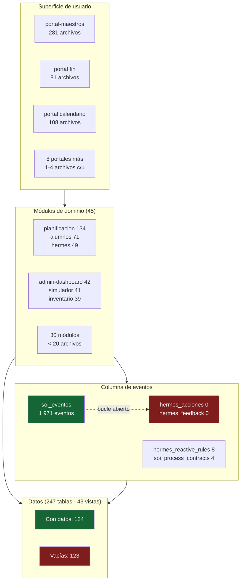
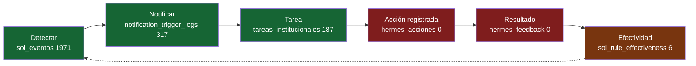
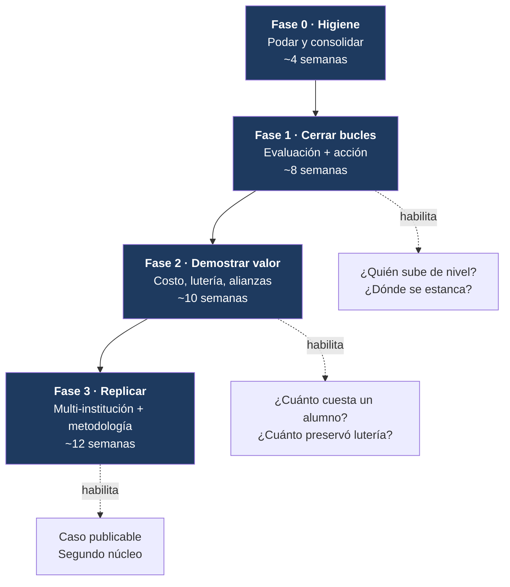

# SOI — Ruta a Referencia

**De sistema interno de FUNEYCA PC a plataforma replicable para educación musical colectiva.**

| | |
|---|---|
| **Estado** | Borrador para revisión |
| **Fecha** | 2026-09-07 |
| **Owner** | Arquitecto SOI |
| **Base** | Documento de visión "Qué tendría que proporcionar SOI" (8 capacidades) |
| **Método** | Inventario de código + conteo de filas reales en producción (`zmhmdvmyeyswunurcyow`) |

---

## 0. Cómo se midió

Este documento no opina sobre lo que *debería* existir: mide lo que **existe y se usa**.

- **Inventario de código**: 45 módulos en `src/modules/`, 11 portales en `src/portales/`, 281 archivos en `src/portal-maestros/`, 385 archivos de test, 298 migraciones SQL.
- **Uso real**: conteo de filas por tabla en la base de producción. Una tabla con filas es una capacidad *adoptada*; una tabla vacía es una capacidad *construida pero no adoptada* (o no terminada).

**Límites de la medición — leer antes de citar cifras:**
- Los conteos vienen de `pg_stat_user_tables.n_live_tup`: son aproximados y se recalculan con `VACUUM`/`ANALYZE`.
- Las **vistas siempre reportan 0** — ese 0 no significa "vacía", significa "no aplica". Ninguna conclusión de este documento se apoya en el conteo de una vista.
- "Tabla con filas" mide *adopción*, no *calidad del dato*. Que `asistencias` tenga 2 288 filas no prueba que la asistencia se tome bien; prueba que se toma.

---

## 1. El hallazgo que ordena todo

```
247 tablas en producción
123 vacías  ██████████████████████████  50 %
124 con datos ██████████████████████████
```

SOI no tiene un problema de **funcionalidad faltante**. Tiene un problema de **capacidad construida y no cerrada**: la mitad del modelo de datos existe, tiene migraciones, tiene código de acceso, y nunca recibió un dato real.

Esto cambia la naturaleza del roadmap. La pregunta no es *"¿qué construimos ahora?"* sino ***"¿qué terminamos de cerrar, qué archivamos, y qué falta de verdad?"***

El riesgo que el documento de visión anticipa — *"un sistema con muchos datos pero pocos indicadores"* — ya es medible: hay muchísima **superficie** y poca **circulación**.

---

## 2. Mapa actual del sistema



**Lectura:** la superficie de usuario está fuertemente concentrada en tres portales; ocho portales son cascarones. La columna de eventos funciona en su tramo de entrada (1 971 eventos emitidos) y está muerta en su tramo de salida (0 acciones registradas).

---

## 3. Semáforo de las 8 capacidades

Escala: 🟢 operando · 🟡 construido, adopción parcial · 🟠 esqueleto sin uso · 🔴 ausente

| # | Capacidad | Estado | Evidencia (filas en producción) | Brecha principal |
|---|---|---|---|---|
| 1 | **Visión completa del alumno** | 🟡 | `alumnos` 288 · `alumnos_clases` 473 · `asistencias` 2 288 · `familias` 298 · `progresos` 219 · `cuotas` 474 · `comodatos_activos` 29 | Los datos existen **dispersos**. No hay expediente único navegable. Faltan repertorio y conciertos por alumno. `observaciones_alumnos` y `alumnos_rutas` en 0. |
| 2 | **Sistema académico estructurado** | 🟡 | `indicators` 4 163 · `nodes` 1 120 · `objetivos` 480 · `levels` 101 · `sesiones_clase` 246 · `observaciones_sesion` 77 | **Catálogo enorme, evaluación mínima**: `evaluacion_indicador` 5, `indicator_attempts` 20 sobre 288 alumnos. Toda la familia `acm_*` (9 tablas) en 0. |
| 3 | **Instrumentos y lutería** | 🟡 / 🟠 | Inventario vivo: `inventario_activos` 324 · `inventario_historial` 475 · `comodatos_activos` 29 | **Inventario sí, lutería no.** `lut_ordenes_reparacion` 1, `lut_diagnosticos` 0, `lut_insumos` 0, `lut_presupuestos` 0, `facturas_reparacion` 0. El indicador estrella del documento (*"RD$480 000 evitados"*) es **hoy imposible de calcular**. |
| 4 | **Operación unificada (evento → consecuencia)** | 🟡 | `soi_eventos` 1 971 · `tareas_institucionales` 187 · `notification_trigger_logs` 317 · `hermes_process_cases` 11 | **Bucle abierto.** Se detecta y se notifica; no se registra qué se hizo ni si sirvió: `hermes_acciones` 0, `hermes_feedback` 0, `student_case_actions` 0, `tarea_logs` 0. |
| 5 | **Alianzas y donaciones** | 🔴 | `contactos_alianzas` 36 — y nada más | `patrocinantes` 0 · `patrocinios` 0 · `prospeccion_log` 0 · `minutas` 0. Módulo `alianzas`: **2 archivos, 0 tests**. Sin compromisos, sin aportes, sin destino de recursos, sin informes por donante. **Es la brecha #1 contra la visión.** |
| 6 | **Finanzas conectadas al impacto** | 🟠 | `cuotas` 474 · `aplicaciones_pago` 4 · `pagos` 2 · `becas` 1 | Hay **cartera**, casi no hay **cobranza registrada**. Y no existe ninguna tabla de **costo**: por alumno, por cátedra, por hora docente. Sin eso, la frase *"este aporte sostuvo 160 horas docentes"* no se puede producir. |
| 7 | **Protección infantil y control** | 🟡 | `permisos_maestros` 29 · `profiles` 35 · RLS activo · `soi_eventos` como rastro de auditoría | `whatsapp_consentimientos` 0 y `whatsapp_optout` 0 con `hermes_whatsapp_queue` en 65 → **se comunica sin registro de consentimiento**. `protocolos` 0. Sin protocolo de incidentes. |
| 8 | **Informes de impacto verificables** | 🟠 | 43 vistas analíticas construidas (`vw_riesgo_abandono`, `vw_mora_activa`, `vw_kpi_inventario`, `vw_rendimiento_maestro`…) | Las vistas existen pero **no hay tablero institucional único** ni trazabilidad número → evidencia. `generated_documents` 0 con `document_templates` 11: las plantillas están, no se emiten documentos. |

### Y una novena, implícita en toda la visión

| # | Capacidad | Estado | Evidencia | Brecha |
|---|---|---|---|---|
| 9 | **Replicabilidad (multi-institución)** | 🔴 | `instituciones`: **0 filas**; la palabra solo aparece en `database.types.ts` generado — **ningún archivo de código la usa** | Nada está *scoped* por institución. Hoy SOI es monoinquilino de facto. Sin esto, los tres niveles de apertura (público / colaborativo / tecnológico) son inalcanzables. |

---

## 4. Las tres brechas estructurales

De las ~40 brechas puntuales de la tabla anterior, solo tres son **estructurales** — las demás son consecuencia de estas.

### Brecha A — El ciclo académico está cortado en la evaluación

El documento de visión propone este ciclo:


**Verde = circula. Rojo = no circula.**

- Plan: `indicators` 4 163, `objetivos` 480, `nodes` 1 120 → ✅
- Clase: `sesiones_clase` 246, `asistencias` 2 288, `observaciones_sesion` 77 → ✅
- Evaluación: `evaluacion_indicador` **5**, `indicator_attempts` **20** → ❌
- Análisis: `cobertura_alumno_objetivo` 0, `student_indicator_progress` 0 → ❌
- Decisión: sin insumo → ❌

**Consecuencia:** SOI hoy es un sistema de asistencia y bitácora con un catálogo curricular muy rico encima. No es todavía un sistema de gestión del aprendizaje. Las preguntas del documento — *"¿quién está preparado para subir de nivel?"*, *"¿dónde se está estancando el aprendizaje?"* — no tienen respuesta con los datos actuales.

### Brecha B — El bucle de eventos no se cierra



Se detecta, se notifica y se crea la tarea. **No se registra qué se hizo ni si funcionó.** Sin ese tramo, Hermes no puede aprender, no puede justificar sus recomendaciones con evidencia, y no puede cumplir los seis puntos que el documento le exige (*qué ocurrió / qué evidencia / por qué importa / qué acción / quién decide / cuándo revisar*).

### Brecha C — No hay dimensión institucional ni dimensión económica

Dos ausencias que se refuerzan:

1. **`instituciones` vacía y sin uso en código** → nada es replicable porque nada está separado por inquilino.
2. **No existe modelo de costo** → el dinero no se puede conectar con el impacto.

Juntas explican por qué SOI todavía no puede ser referencia: *no puede demostrar su valor en términos económicos, ni instalarse en otra organización.*

---

## 5. Roadmap

Cuatro fases. Cada una tiene **criterio de salida medible** — un número que hoy es 0 o casi 0 y que al cerrar la fase no lo es.



---

### Fase 0 — Higiene: podar antes de construir

> **Principio:** no se puede optimizar un sistema del que nadie sabe qué mitad está viva.

| # | Acción | Entregable |
|---|---|---|
| 0.1 | Clasificar las **123 tablas vacías** en tres cubetas: *terminar* / *archivar* / *eliminar* | `docs/INVENTARIO_TABLAS_2026Q3.md` con decisión por tabla |
| 0.2 | Ejecutar la poda: `DROP` de las eliminables, `COMMENT ON TABLE ... IS 'DEPRECATED …'` en las archivables | Migración de poda |
| 0.3 | Decidir el destino de la familia `acm_*` (9 tablas, 0 filas) — ¿reemplaza a `planificacion` o se archiva? | ADR |
| 0.4 | Consolidar los 8 portales-cascarón: activarlos o retirarlos del `portal_catalog` | `portal_catalog` refleja solo portales reales |
| 0.5 | Reconciliar `supabase/migrations/schema_reference.sql` con el esquema real (hoy está desfasado) | Reference regenerado desde producción |

**Criterio de salida:** tablas vacías ≤ 40, y cada una con un dueño y una fecha objetivo.

---

### Fase 1 — Cerrar los dos bucles

Esta fase convierte SOI de *registro* en *sistema*.

#### 1A · Bucle académico (Brecha A)

| # | Acción | Por qué |
|---|---|---|
| 1.1 | Instrumentar la captura de evaluación en el flujo real del maestro — que evaluar sea parte de dar clase, no un formulario aparte | Hoy `indicator_attempts` = 20. El catálogo (4 163 indicadores) es inservible sin intentos |
| 1.2 | Poblar `cobertura_alumno_objetivo` y `student_indicator_progress` por agregación desde los intentos | Es el insumo del análisis |
| 1.3 | Construir la vista **"¿quién está listo para subir de nivel?"** sobre `indicador_prerequisito` + progreso | Pregunta explícita del documento de visión |
| 1.4 | Construir la vista **"¿dónde se estanca el aprendizaje?"** (indicadores con más intentos fallidos por cátedra) | Pregunta explícita del documento de visión |

**Criterio de salida:** `indicator_attempts` > 2 000 · `cobertura_alumno_objetivo` poblada para ≥ 80 % de alumnos activos · las dos vistas responden en el portal.

#### 1B · Bucle de acción (Brecha B)

| # | Acción | Por qué |
|---|---|---|
| 1.5 | Hacer obligatorio el registro de resultado al cerrar una tarea de seguimiento → escribe en `hermes_acciones` | Sin esto Hermes no puede justificar nada |
| 1.6 | Capturar feedback humano sobre cada recomendación (`hermes_feedback`) | Requisito de *"revisión humana antes de decisiones delicadas"* |
| 1.7 | Alimentar `soi_rule_effectiveness` desde acción + feedback y exponerlo | Permite apagar reglas que no sirven |
| 1.8 | Estandarizar el **formato de recomendación de 6 campos** del documento (qué ocurrió / evidencia / por qué importa / acción / quién decide / cuándo revisar) como contrato de salida de Hermes | Es el diferenciador declarado |

**Criterio de salida:** ≥ 90 % de las tareas de seguimiento cerradas tienen acción registrada · toda recomendación de Hermes trae los 6 campos y un enlace a su evidencia.

#### 1C · Expediente único del alumno (Brecha 1)

| # | Acción |
|---|---|
| 1.9 | Vista transversal por alumno que reúna: asistencia · nivel · progreso · repertorio · evaluaciones · ensambles · comodato de instrumento · situación de pago/beca · alertas · historial de estado |
| 1.10 | Añadir el eje faltante: **repertorio y participación en conciertos** por alumno (`repertoire_items` existe con 14 filas; falta el vínculo alumno↔repertorio↔concierto) |

**Criterio de salida:** una URL por alumno que responda las cinco preguntas del documento sin abrir otro módulo.

---

### Fase 2 — Demostrar valor en números

Esta fase produce las frases que el documento pide poder decir.

#### 2A · Lutería con valor económico

| # | Acción |
|---|---|
| 2.1 | Activar el flujo real de taller: diagnóstico → presupuesto → orden → insumos → evidencia → cierre (las 7 tablas `lut_*` existen y están vacías) |
| 2.2 | Registrar **costo de reparación** y **valor de reposición evitado** por instrumento recuperado |
| 2.3 | Registrar **tiempo fuera de servicio** y disponibilidad por cátedra y talla |

**Criterio de salida:** poder emitir, con trazabilidad al instrumento individual —
> *"El taller recuperó N instrumentos, devolvió M a las aulas y evitó RD$X en reposiciones."*

#### 2B · Costo conectado al impacto

| # | Acción |
|---|---|
| 2.4 | Modelo de costo: costo por hora docente, por cátedra, por programa, por alumno |
| 2.5 | Trazabilidad de **aportes restringidos**: de qué donante vino cada peso y a qué se destinó |
| 2.6 | Cerrar el circuito de cobranza (hoy `pagos` = 2 sobre `cuotas` = 474) |

**Criterio de salida:** poder emitir —
> *"Este aporte sostuvo N horas docentes, benefició a M estudiantes y mantuvo K ensambles durante el trimestre"* — con el número rastreable hasta sus comprobantes.

#### 2C · Alianzas (Brecha 5 — construir desde cero)

| # | Acción |
|---|---|
| 2.7 | Modelo de relación con aliado: objetivo, conversaciones, documentos, **compromisos con fecha y responsable**, aportes solicitados vs recibidos, población beneficiada, evidencias pendientes, informes entregados, ventana de renovación |
| 2.8 | Generador de informes por perfil de aliado (uso de insumos / expansión e impacto / inclusión y ciudadanía / cobertura académica / beneficio comunitario) sobre `document_templates` |
| 2.9 | Alertas de compromiso próximo a vencer vía el bucle de Hermes ya cerrado en Fase 1 |

**Criterio de salida:** un informe de aliado generado automáticamente, con cada cifra enlazada a su evidencia, aceptado por un aliado real.

#### 2D · Protección (Brecha 7)

| # | Acción |
|---|---|
| 2.10 | Registro de consentimiento para imágenes y comunicaciones **antes** de enviar (hoy `hermes_whatsapp_queue` = 65 con `whatsapp_consentimientos` = 0) |
| 2.11 | Protocolo de incidentes con responsable identificable |
| 2.12 | Barrera explícita: Hermes recomienda y advierte; **nunca** expulsa, sanciona ni etiqueta automáticamente |

**Criterio de salida:** ningún envío sale sin consentimiento verificable · toda acción sensible tiene decisor humano registrado.

---

### Fase 3 — Replicar

#### 3A · Multi-institución (Brecha C)

| # | Acción |
|---|---|
| 3.1 | Activar `instituciones` como inquilino real y propagar `institucion_id` por el modelo de datos |
| 3.2 | Extender RLS a aislamiento por institución |
| 3.3 | Convertir en configuración lo que hoy está cableado a FUNEYCA: niveles, cátedras, familias instrumentales, calendario, políticas de cobranza, reglas reactivas |
| 3.4 | Activación de módulos por institución (`modulos` + `portal_catalog`), para que una organización pequeña arranque con asistencia + instrumentos |

> **Regla rectora:** *lo particular de FUNEYCA se configura; lo común a las organizaciones musicales se convierte en estándar.*

**Criterio de salida:** una segunda institución de prueba operando en la misma instalación, sin ver datos de la primera y sin tocar código.

#### 3B · Los tres niveles de apertura

| Nivel | Contenido | Entregable |
|---|---|---|
| **Público** | Metodología operativa · modelo de indicadores · manuales y casos · formatos de planificación · criterios de evaluación · buenas prácticas de datos · resultados agregados sin datos personales | Sitio de metodología + caso de estudio |
| **Colaborativo** | Plantillas configurables · capacitación · diagnóstico · tableros comparativos anónimos · acompañamiento · comunidad | Programa de implementación |
| **Tecnológico** | SOI configurable con módulos activables | Instalación replicable |

#### 3C · Independencia del autor

> Riesgo declarado en la visión: *"una plataforma que depende de Omar para entenderla"*.

| # | Acción |
|---|---|
| 3.5 | Documentar la metodología, no solo el software |
| 3.6 | Onboarding operativo verificable: que un tercero instale y configure SOI sin intervención del autor |

**Criterio de salida:** un tercero completa una instalación siguiendo solo la documentación.

---

## 6. Tablero de validación

Antes de presentar SOI como modelo externo, el documento exige demostrarlo en El Sistema PC. Estos son los indicadores, con su punto de partida real:

| Área | Indicador | Hoy | Meta de validación |
|---|---|---|---|
| Acceso | Alumnos activos / becados / nuevos / en espera | 288 alumnos · 404 postulantes · 1 beca | Serie mensual completa |
| Permanencia | Retención, ausencias atendidas, abandono | `asistencias` 2 288 · `justificaciones` 141 | Reducción medible de ausencias no atendidas |
| Aprendizaje | Progreso por nivel, instrumento y competencia | `indicator_attempts` 20 | > 2 000 intentos · cobertura ≥ 80 % |
| Docencia | Planificaciones, clases, cumplimiento | `sesiones_clase` 246 · `maestro_desempeno` 4 | Plan vs impartido por cátedra |
| Liderazgo | Monitores formados, horas de apoyo | sin modelo | Modelo de monitor + primeras horas |
| Instrumentos | Disponibles / prestados / dañados / recuperados | `inventario_activos` 324 · `comodatos_activos` 29 · recuperados **0** | Ciclo de lutería completo con valor preservado |
| Finanzas | Costos, ingresos, ejecución, sostenibilidad | `cuotas` 474 · `pagos` 2 | Costo por alumno + ejecución vs presupuesto |
| Comunidad | Conciertos, familias, alianzas | `familias` 298 · `contactos_alianzas` 36 | Alianzas con compromisos y aportes trazados |
| Impacto | Resultados académicos, sociales, testimoniales | vistas construidas, sin tablero | Tablero único con trazabilidad a evidencia |

**Regla no negociable:** todo número del tablero debe poder rastrearse hasta su origen. *Un número sin evidencia no genera confianza.*

---

## 7. Anti-objetivos

Lo que este roadmap se compromete a **no** hacer:

- ❌ Añadir portales nuevos antes de consolidar los ocho cascarones existentes
- ❌ Añadir tablas nuevas mientras haya 123 vacías sin dueño
- ❌ Dejar que Hermes tome decisiones sin evidencia trazable ni decisor humano
- ❌ Modelar excepciones de FUNEYCA en el esquema en lugar de en configuración
- ❌ Publicar el caso de estudio antes de que los indicadores de la §6 estén poblados

---

## 8. Secuencia recomendada

Si hubiera que elegir **un solo movimiento** para empezar: **Fase 0.1** — clasificar las 123 tablas vacías.

No es glamoroso, pero desbloquea todo lo demás: define qué se termina, revela cuánta de la visión ya está a medio construir, y evita que la Fase 1 agregue superficie sobre superficie.

El segundo movimiento es **1.1** — hacer que evaluar sea parte de dar clase. Es el único cambio que convierte el activo más grande de SOI (4 163 indicadores) de inventario muerto en sistema vivo.

---

## Anexo · Fuentes

- Conteos de producción: proyecto Supabase `zmhmdvmyeyswunurcyow` (`SOI_DDBB_EL_SISTEMAPC`), 2026-09-07.
- Inventario de código: `src/modules/` (45), `src/portales/` (11), `src/portal-maestros/` (281 archivos), 385 archivos de test, 298 migraciones.
- Documento de visión: "Qué tendría que proporcionar SOI" (8 capacidades, 3 niveles de apertura, rol de Hermes).
- Lenguaje de dominio: [`CONTEXT.md`](../CONTEXT.md).
- Arquitectura técnica vigente: [`docs/ARCHITECTURE.md`](./ARCHITECTURE.md).
