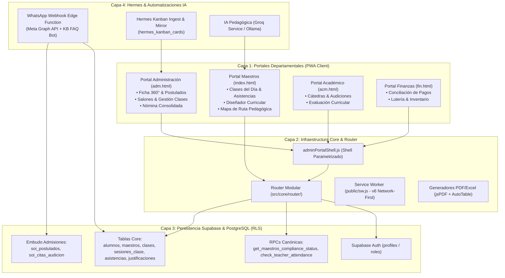

# Arquitectura Canónica del Sistema Operativo Institucional (SOI)

Documento maestro de referencia para el equipo de desarrollo, arquitectura y agentes de IA.

---

## 1. Visión Panorámica del Sistema

---

## 2. Los 4 Pilares Arquitectónicos

### 1. Portales como "Lentes", No Copias de Datos
Los datos residen en **Supabase una sola vez**. Cada portal departamental (`adm.js`, `acm.js`, `fin.js`) es únicamente una **lente** que define:
- Qué grupos de navegación mostrar.
- Qué módulos registrar en el router.
- Qué roles tienen autorización de acceso.

### 2. Modularidad Autocontenida
Cada funcionalidad reside en `src/modules/[nombre]/` y expone:
- `api/`: Llamadas canónicas a Supabase / RPCs.
- `components/`: Modales y componentes interactivos reutilizables.
- `domain/`: Lógica de negocio pura (cálculos de solvencia, generadores PDF/Excel, validaciones).
- `views/`: Vistas completas que se montan en el router.

### 3. Service Worker `Network-First` (v6)
Para erradicar vistas viejas y permitir actualizaciones instantáneas:
- **`Network-First`** para todo el código JavaScript, CSS y HTML.
- Auto-purga en `localhost` mediante `early-error-suppression.js`.
- Actualización en caliente automática vía `SKIP_WAITING` + `controllerchange`.

### 4. Automatización & Hermes
- **WhatsApp Webhook:** Chatbot de admisiones y recordatorios docentes.
- **Kanban Mirror:** Tablero de tareas interno de Hermes reflejado en tiempo real en el portal administrativo.

---

## 3. Diagrama Visual Interactivo

Se ha generado una versión interactiva HTML con animaciones y filtrado por capas disponible en:
[`docs/architecture/soi_architecture_diagram.html`](./soi_architecture_diagram.html)
