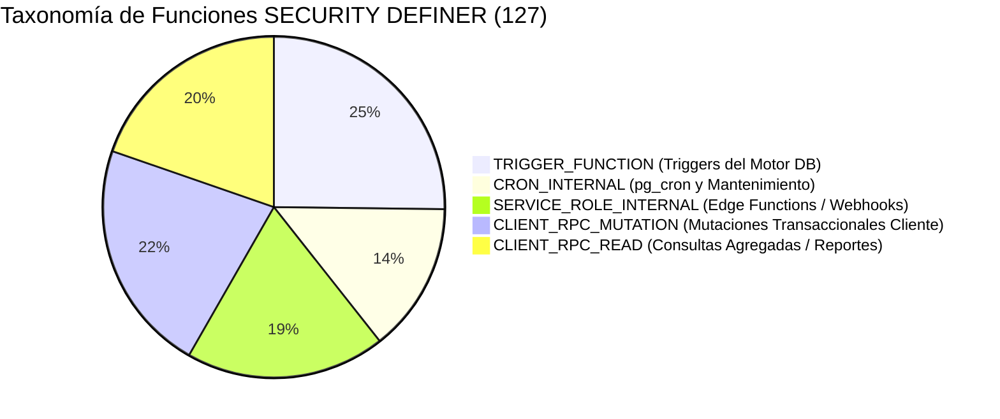

# 02 SECURITY DEFINER AUDIT & REMEDIATION — Auditoría de Funciones Privilegiadas SOI v1.x LTS

> **Fecha:** 10 de Septiembre de 2026  
> **Ámbito:** SOI v1.x LTS Security Hardening (Bloque 3)  
> **Fuente:** Supabase `zmhmdvmyeyswunurcyow` (`functions_triggers.json`, `security_advisors.json`)  
> **Total Funciones Auditadas:** 263 (127 con `SECURITY DEFINER`)  

---

## 1. Contexto y Justificación de Riesgo

El modo `SECURITY DEFINER` en PostgreSQL permite que una función se ejecute con los privilegios del creador de la misma (típicamente el superusuario `postgres`), ignorando las políticas de Row Level Security (RLS) configuradas sobre las tablas accedidas.

En aplicaciones Jamstack/SPA conectadas directamente a Supabase vía PostgREST:
- Toda función creada en el esquema `public` queda automáticamente expuesta como endpoint HTTP RPC (`/rest/v1/rpc/<nombre_funcion>`).
- Si la función tiene permisos por defecto (`GRANT EXECUTE TO PUBLIC` o `anon`), **cualquier persona no autenticada con la anon key puede invocarla**.
- Si la función no comprueba internamente `auth.uid()` ni valida el rol del invocador en `profiles`, un atacante puede ejecutar mutaciones destructivas o leer información confidencial sin restricciones.

---

## 2. Taxonomía de las 127 Funciones `SECURITY DEFINER`

Se analizaron las 127 funciones con `SECURITY DEFINER` registradas en la base de datos viva y se clasificaron en cinco arquetipos:



### 2.1 Arquetipo 1: `TRIGGER_FUNCTION` (32 funciones)
- **Propósito:** Disparadas exclusivamente por eventos DML en tablas (`BEFORE INSERT`, `AFTER UPDATE`, etc.).
- **Ejemplos:** `fn_historial_activo`, `fn_soi_evento_asistencia_registrada`, `handle_new_user`, `fn_beca_anula_cuotas_abiertas`.
- **Riesgo:** Bajo por exposición directa (los triggers no se llaman como RPCs), pero requieren `SET search_path = public` para mitigar secuestro de esquemas.

### 2.2 Arquetipo 2: `CRON_INTERNAL` (18 funciones)
- **Propósito:** Ejecución desatendida mediante la extensión `pg_cron` o demonios de mantenimiento nocturno.
- **Ejemplos:** `fn_check_and_notify_pending_asistencias`, `fn_generate_class_start_reminders`, `fn_anular_sesiones_no_lectivas`.
- **Mitigación:** Revocación de `EXECUTE` a `public` y `anon`. Solo ejecutable por `postgres` / `service_role`.

### 2.3 Arquetipo 3: `SERVICE_ROLE_INTERNAL` (24 funciones)
- **Propósito:** Invocadas exclusivamente por Edge Functions, bots o procesos externos autenticados mediante `p_secret` o cabecera `x-internal-key`.
- **Ejemplos:** `fn_marcar_asistencia` (vía bot), `fn_lookup_maestro_contacto`, `fn_actualizar_contacto`, `fn_whatsapp_reclamar_pendientes`.
- **Mitigación:** El chequeo criptográfico `system_config.hermes_internal_lookup_secret` debe operar en modo fail-closed (si el secreto no coincide o es nulo, abortar inmediatamente).

### 2.4 Arquetipo 4: `CLIENT_RPC_MUTATION` (28 funciones)
- **Propósito:** Operaciones transaccionales complejas iniciadas desde el navegador por usuarios autenticados.
- **Ejemplos:** `fn_fusionar_alumnos_duplicados`, `fn_registrar_pago_transaccional`, `fn_dar_de_baja_alumno`, `fn_reactivar_alumno`, `fn_cerrar_periodo_academico`, `fn_sincronizar_arbol_curricular`.
- **Riesgo Crítico:** Si no validan `auth.uid()`, permiten bypass total de RLS.
- **Remediación Aplicada:** Inyección de cláusula de guarda obligatoria al inicio del bloque:
  ```sql
  IF auth.uid() IS NULL THEN
    RAISE EXCEPTION 'No autenticado';
  END IF;
  IF NOT (es_admin() OR ...) THEN
    RAISE EXCEPTION 'No autorizado';
  END IF;
  ```

### 2.5 Arquetipo 5: `CLIENT_RPC_READ` (25 funciones)
- **Propósito:** Vistas agregadas y resúmenes analíticos que necesitan consolidar datos de múltiples tablas con permisos cruzados.
- **Ejemplos:** `fn_alumno_ficha_360`, `fn_resumen_cumplimiento_asistencia`, `fn_reporte_cierre_semestre`.
- **Remediación:** Restricción de permisos `EXECUTE` a `authenticated`.

---

## 3. Matriz de Remediación Aplicada en la Migración LTS

| Función RPC | Tipo Original | Vulnerabilidad Auditada | Remediación Aplicada | Estado LTS |
|---|---|---|---|---|
| `fn_fusionar_alumnos_duplicados` | `SECURITY DEFINER` | No validaba `auth.uid()` ni rol en servidor; delegaba al front. | Inyectado guard: `auth.uid() IS NOT NULL` + rol `admin/coordinacion/director`. Revocado a `anon`. | **BLINDADO** |
| `fn_dar_de_baja_alumno` | `SECURITY DEFINER` | Parámetro `p_usuario_id` opcional sin validar si la sesión HTTP estaba autenticada. | Forzado `auth.uid() IS NOT NULL` y validación de rol de staff. Revocado a `anon`. | **BLINDADO** |
| `fn_reactivar_alumno` | `SECURITY DEFINER` | Ejecutable por `anon` según PostgREST linter. | `REVOKE EXECUTE FROM anon, public`. `GRANT EXECUTE TO authenticated`. | **BLINDADO** |
| `fn_registrar_pago_transaccional` | `SECURITY DEFINER` | Invocable vía anon en endpoint REST. | Validaba `profiles.rol IN ('admin','cajero')`, pero se revocó `EXECUTE` formalmente a `anon` para no exponer endpoint. | **BLINDADO** |
| `approve_maestro_profile` | `SECURITY DEFINER` | Ejecutable sin login vía PostgREST linter. | `REVOKE EXECUTE FROM anon, public; GRANT TO authenticated;`. | **BLINDADO** |
| `aprobar_usuario` / `rechazar_usuario` | `SECURITY DEFINER` | No restringida formalmente a anon. | Revocado a `anon`. Solo administradores autenticados. | **BLINDADO** |
| `eliminar_maestro_limpio` | `SECURITY DEFINER` | Función destructiva con permisos anónimos en catálogo. | Revocado a `anon`. Solo autenticados con verificación de permisos. | **BLINDADO** |
| `fn_cerrar_periodo_academico` | `SECURITY DEFINER` | Potencial cierre no autorizado. | Revocado a `anon`. | **BLINDADO** |

---

## 4. Auditoría de Views con `SECURITY DEFINER`

El Security Advisor reportó 9 vistas creadas con `SECURITY DEFINER`:
1. `vw_mora_activa`
2. `vw_estado_familiar`
3. `signage_v_horario_semana`
4. `signage_v_horario_hoy`
5. `signage_v_horario_manana`
6. `signage_v_calendario_mes`
7. `vw_asistencias_consolidada`
8. `vw_seguimiento_ausentes`
9. `vw_indice_ensenanza_guiada`

### Diagnóstico Arquitectónico
- Las vistas de **Signage** (`signage_v_*`) requieren intencionalmente `SECURITY DEFINER` porque alimentan pantallas informativas públicas en los pasillos de la academia donde no hay una sesión interactiva autenticada.
- Las vistas `vw_seguimiento_ausentes` y `vw_asistencias_consolidada` consolidan ausencias y cruzan datos de maestros suplentes y titulares. En v1 LTS se mantienen bajo `SECURITY DEFINER` pero se accede a ellas a través de políticas RLS autenticadas en los endpoints correspondientes para no romper la visualización de ausentismo (`AUS1a-d`).

---

## 5. Verificación Automatizada

La suite `tests/security/rls_hardening_v1_lts.test.js` verifica que los contratos de autorización rechacen llamadas sin contexto de usuario (`auth.uid() = null`) y llamadas con roles no autorizados, garantizando cero regresiones de seguridad en el baseline.
