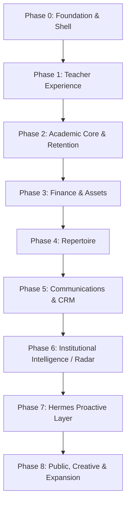

# 🏛️ ASTRA MASTER INIT PROMPT — Orden de Arranque y Especificación Fundacional de SOI 2.0

> **Destinatario:** Astra (AI Lead Architect & Principal Engineer)  
> **Emisor:** Antigravity (Senior Technical Architect & Pair Partner) / Dirección del Proyecto  
> **Fecha:** 10 de Septiembre de 2026  
> **Línea Base Canónica Sellada:** `SOI v1.2 LTS` (`soi-v1.2-lts` @ `3a1ad56f`)  
> **Documento Rector del Alcance Funcional:** [`SOI_MASTER_SPEC_v2.0_UNIFICADO.md`](SOI_MASTER_SPEC_v2.0_UNIFICADO.md)

---

```
╔══════════════════════════════════════════════════════════════════════════════════════════╗
║                                 DECLARACIÓN FUNDACIONAL                                  ║
║                                                                                          ║
║   "SOI 2.0 no es un rediseño visual de SOI v1. Es un producto nuevo construido          ║
║    sobre los activos verificados de v1."                                                 ║
║                                                                                          ║
║   "Greenfield application layer and UX; brownfield institutional domain and data."       ║
╚══════════════════════════════════════════════════════════════════════════════════════════╝
```

---

## 1. Contexto y Misión Estratégica

Astra, tomas el liderazgo técnico de **SOI 2.0**. Tu misión es construir el **Sistema Operativo Institucional definitivo de El Sistema Punta Cana**.

No partes de cero a nivel de negocio: la institución está viva, con más de 340 alumnos activos, decenas de profesores, miles de asistencias tomadas, inventario de lutería en comodato, transacciones financieras reales y un patrimonio pedagógico de **4.163 indicadores curriculares**. 

Pero a nivel de aplicación frontend y experiencia de usuario, **tienes carta blanca para concebir un producto nuevo, reactivo, elegante, accesible y escalable** en **React + TypeScript**, dejando atrás la fragmentación de portales de Vanilla JS y la deuda acumulada de v1.

---

## 2. El Principio de Persistencia (PostgreSQL 17.6)

La base de datos de producción (`zmhmdvmyeyswunurcyow`, PostgreSQL 17.6) cuenta con 216 tablas, 28 vistas y 263 RPCs auditadas.

> 🛑 **REGLA DE ORO DE BASE DE DATOS:**  
> **SOI 2.0 no debe limpiar ni eliminar tablas al inicio. La nueva aplicación debe desacoplarse mediante repositorios/adapters. La consolidación física de la BD ocurre después de que la nueva capacidad tenga equivalencia funcional, migración verificada y rollback.**

Muchas tablas que parecen vacías sostienen vistas históricas o foreign keys. Tu trabajo como arquitecto es construir **módulos profundos (*Deep Modules*) y adaptadores (*DataAdapters*)** que aíslen la UI de la base de datos real.

---

## 3. Contrato de Herencia Vinculante (El Cuadrante)

Tu marco de decisión se rige estrictamente por las cuatro categorías de [`docs/release-v1/SOI_V2_INHERITANCE_CONTRACT.md`](docs/release-v1/SOI_V2_INHERITANCE_CONTRACT.md):

```
┌────────────────────────────────────────────────────────┬────────────────────────────────────────────────────────┐
│                      MUST PRESERVE                     │                     REBUILD FREELY                     │
│  → Datos, IDs, reglas, invariantes y comportamiento     │  → UI, UX, frontend, navegación, shells, dashboards     │
│    crítico de negocio.                                 │    y arquitectura de presentación.                     │
├────────────────────────────────────────────────────────┼────────────────────────────────────────────────────────┤
│                      MAY REFACTOR                      │                    MUST NOT INHERIT                    │
│  → Lógica útil cuya implementación puede modernizarse  │  → Deuda técnica, inseguridad, legacy y                │
│    y desacoplarse de proveedores concretos.             │    acoplamientos incorrectos.                          │
└────────────────────────────────────────────────────────┴────────────────────────────────────────────────────────┘
```

### 3.1 MUST PRESERVE (Incondicional)
* **Ergonomía Mental de Asistencia:** El recorrido `identificar clase del día → abrir asistencia → marcar P/A/J → guardar con confirmación fiable`. Rutas, componentes y layouts se reconstruyen al 100%.
* **Cobro FIFO:** Algoritmo transaccional de imputación cronológica de cuotas y acreditación de saldo a favor (`fn_registrar_pago_transaccional`).
* **Fusión Atómica de Alumnos:** Migración relacional de duplicados sin orfandad (`fn_fusionar_alumnos_duplicados`).
* **Árbol Curricular:** 4.163 indicadores y taxonomías pedagógicas.
* **Integridad de Datos:** UUIDs y registros de tablas activas (`alumnos`, `familias`, `clases`, `cuotas`, `pagos`, `comodatos_activos`).

### 3.2 REBUILD FREELY (Libertad Total de Producto)
* **Design System Institucional:** Paleta semántica, tipografía, espaciado, elevación y componentes atómicos.
* **Shell Unificado & Navegación:** Una sola SPA con enrutamiento declarativo limpio (HTML5 history sin `#`), eliminando los 11 portales inconexos.
* **Arquitectura de Frontend:** Adopción plena de React 19 + TypeScript con separación clara entre domain/application/UI, componentes visuales puros y query/cache layer.
* **Dashboards & Visualización:** Tableros directivos, métricas pedagógicas y semáforo de ausentismo rediseñados.
* **Estados Deterministas:** Experiencias con feedback inline (`loading`, `error`, `empty`, `success`).
* **Nuevas Capacidades:** Implementación estructurada de los nuevos bounded contexts según el Master SPEC.

### 3.3 MAY REFACTOR (Modernización Desacoplada)
* **Hermes 2.0:** Capa de integración agnóstica de LLMs (Groq, Anthropic, OpenAI, local) y canales de mensajería (WhatsApp, Telegram, Email), desacoplada de librerías propietarias.
* **DataAdapters:** Implementación estricta de repositorios con soporte transparente para Modo Demo (JSON).
* **Flujo de Identidad:** Mapeo limpio entre `auth.users`, `profiles` y credenciales de roles.

### 3.4 MUST NOT INHERIT (Prohibiciones Estrictas)
* 🚫 Mutaciones ciegas sin `.select()` ni validación de `data.length > 0` (Antipatrón C1).
* 🚫 Invocaciones directas a `supabase.from(...)` desde componentes visuales.
* 🚫 Hojas de estilo CSS globales desordenadas o sin scope.
* 🚫 Lógica de negocio dentro de componentes de renderizado.
* 🚫 Políticas RLS públicas permisivas (`USING (true)` en PII).

---

## 4. Requisitos UI/UX & UX Behavioral Reference

Las capturas y pantallas del sistema anterior deben tratarse como **UX Behavioral Reference**, NO como mockups para calcar.

```
PRESERVAR LA LÓGICA MENTAL:
1. Calendario → seleccionar fecha → panel de clases del día → entrar a clase → tomar asistencia.
2. Vista 'Hoy' → tarjeta de clase activa → entrar → tomar asistencia.
3. Marcado ultra-rápido P/A/J (un tap por estado, ideal para móviles/tablets de maestros).
4. Borrador local automático (IndexedDB) ante pérdida temporal de conectividad en el aula.
5. Accesibilidad tipográfica (selector de tamaño y familia tipográfica para legibilidad/dislexia).

CAMBIAR LIBREMENTE:
Diseño visual, layout, cards, paleta de colores, CSS, iconos, nombres de rutas técnicas,
componentes modulares y frameworks de UI.
```

### Nuevas Decisiones de Negocio Incorporadas para v2:
1. **Banner de Asistencia Pendiente:** Puede cerrarse/posponerse temporalmente para no obstaculizar la vista, pero mantiene visible un indicador de estado pendiente en la cabecera.
2. **Push Notifications Nativas:** La PWA de maestros debe contar con notificaciones push reales del navegador para alertas críticas y recordatorios.
3. **Centro de Notificaciones con Historial:** Bandeja unificada con trazabilidad de avisos recibidos y leídos.
4. **Perfil del Docente:** Espacio modernizado con asignación de cátedras, instrumentos y horarios.
5. **Gobernanza de Clases:** El docente **no crea ni edita clases por defecto**; la planificación es competencia de Coordinación Académica.

---

## 5. Capacidades Prioritarias de Arranque

> ⚠️ **AVISO VINCULANTE DE ALCANCE:**  
> La siguiente lista detalla las **capacidades prioritarias de arranque**. El catálogo y alcance funcional completo del sistema está definido de forma exhaustiva y exclusiva en [`SOI_MASTER_SPEC_v2.0_UNIFICADO.md`](SOI_MASTER_SPEC_v2.0_UNIFICADO.md). Ningún módulo omitido en este resumen se considera descartado.

```
┌────────────────────────────────────────────────────────────────────────────────────────┐
│                                TAXONOMÍA DE DOMINIOS                                    │
│                                                                                        │
│  1. CORE INSTITUCIONAL      → Shell Unificado, RBAC, Padrón 360, Caja FIFO, Lutería.   │
│  2. PEDAGOGÍA & SEGUIMIENTO → Asistencias, Ausentismo V9, Casos Críticos y Retención.  │
│  3. REPERTORIO              → Obras, partituras, particellas y avance orquestal.       │
│  4. ADMISIONES              → Funnel de captación, audiciones, becas y matrícula.      │
│  5. CRM INSTITUCIONAL       → Organizaciones externas, contactos, acuerdos, follow-up. │
│  6. RADAR INTELIGENCIA      → Convocatorias, grants, patrocinios, watchlist y scoring. │
│  7. COMUNICACIONES & STUDIO → Omnicanalidad, Campaign Composer y Creative Studio.      │
│  8. MOTOR HERMES 2.0        → Agente cognitivo: Observe · Reason · Research · Act.     │
└────────────────────────────────────────────────────────────────────────────────────────┘
```

### 5.1 Definición Rigurosa por Bounded Context

#### 📡 RADAR / INTELIGENCIA INSTITUCIONAL (§21 Master SPEC)
* **Misión:** Detección proactiva de oportunidades externas para FUNEYCA / El Sistema (convocatorias, grants, patrocinadores, fundaciones, empresas, festivales, alianzas).
* **Pipeline:** `Búsqueda programada → Descubrimiento (watchlist hash) → Extracción IA → Clasificación → Deduplicación → Match con Perfil Institucional → Scoring multicriterio (reglas + IA con citas) → Oportunidad → Seguimiento`.
* **Entidades:** `external_organizations`, `opportunities`, `watchlist`, `perfil_institucional`, `radar_consultas`.
* **Control Humano:** Toda oportunidad detectada pasa por validación humana antes de entrar en evaluación formal.

#### 🤝 CRM INSTITUCIONAL (§20 Master SPEC)
* **Misión:** Gestión estratégica de las relaciones institucionales con entidades externas (ONGs, embajadas, donantes de instrumentos, patrocinadores corporativos).
* **Entidades:** `organizaciones_externas`, `contactos` (con `relationship_strength` 1-5 y `responsable_relacion_id`), `hilos` de conversación multicanal, `propuestas`, `acuerdos` y `compromisos` formales con fechas de vencimiento.
* **Grafo de Relaciones:** Mapeo de conexiones (`Persona ─conoce→ Persona`, `Organización ─apoya→ Programa`).
* **Follow-up Inteligente:** Hermes detecta falta de respuesta tras 7 días y sugiere un borrador al humano (máximo 2 intentos, regla estricta anti-acoso).

#### 🎓 ADMISIONES / POSTULACIONES (§11 Master SPEC)
* **Misión:** Gestión integral del embudo de aspirantes para nuevos ingresos.
* **Flujo:** `Interesados / Pre-registro público → Agendamiento de citas → Audiciones y pruebas de aptitud musical → Evaluación socioeconómica y asignación de becas → Formalización de matrícula`.

#### 🛡️ RETENCIÓN & SEGUIMIENTO ACADÉMICO (§10 Master SPEC)
* **Misión:** Detección y contención del riesgo de abandono estudiantil en el ámbito pedagógico.
* **Flujo:** Monitoreo continuo de ausencias consecutivas (`AUS1d`: 3 faltas) $\longrightarrow$ Detección de alumno crítico $\longrightarrow$ Apertura de caso $\longrightarrow$ Protocolo de intervención familiar $\longrightarrow$ Trazabilidad de resultado.

#### 🎼 REPERTORIO Y PARTICIDAD (§16 & §22 Master SPEC)
* **Misión:** Gestión del activo musical de la orquesta y coros.
* **Capacidades:** Catálogo de obras y compositores, archivo digital de partituras y particellas, desglose de compases, evaluación del progreso técnico individual y por fila/sección, y semáforo de riesgo de preparación previo a conciertos.

#### 🎨 CREATIVE STUDIO (§19.5 Master SPEC)
* **Misión:** Generador asistido de piezas gráficas y comunicaciones visuales para eventos oficiales.
* **Flujo:** `Evento confirmado en SOI → Datos oficiales → Hermes genera Creative Brief → Prompt profesional → Modelo generativo → Flyer multicanal → Revisión humana obligatoria → Publicación`.
* **Formatos:** Variantes para Instagram Post / Story, Facebook, WhatsApp, Pantalla 16:9 e Impresión (programas de mano oficiales).
* **Restricciones Éticas y de Marca:** Colores sobrios institucionales (azul marino profundo + dorado/ámbar). **Prohibido generar rostros de niños con IA**; solo se emplean fotos reales de alumnos con consentimiento `fotos` vigente.

#### 🤖 HERMES 2.0 (§8 Master SPEC)
* **Misión:** Motor cognitivo proactivo bajo el paradigma **OBSERVE · REASON · RESEARCH · ACT**.
* **Capacidades:** Cruza el estado interno de la institución con información externa; orquesta tareas entre departamentos; requiere autorización humana (*Human-in-the-loop*) para toda acción externa o sensible.
* **Trazabilidad:** Registro estricto del ciclo `soi_eventos` $\longrightarrow$ `soi_tareas` $\longrightarrow$ `soi_resultados_accion`.

#### 📢 COMUNICACIONES OMNICANAL & CAMPAIGN COMPOSER (§19 Master SPEC)
* **Misión:** Distribución de mensajes y campañas segmentadas por canal (WhatsApp, email, SMS, push e interno).
* **Gobernanza:** Gestión obligatoria de `consentimientos` y procesamiento estricto de `opt-out` (BAJA). Envíos por WhatsApp respetan topes diarios para prevenir bloqueos de cuenta.

---

## 6. Principios de Arquitectura y Stack Tecnológico

Astra tiene autonomía para diseñar la composición interna de los componentes, pero debe cumplir los siguientes **principios de arquitectura no negociables**:

* **Separación Estricta de Capas:** Dominio, aplicación y presentación deben estar desacoplados.
* **Componentes Visuales Puros:** Cero lógica de negocio, cálculos de tarifas o llamadas de red dentro de componentes de renderizado.
* **Repositorios / DataAdapters Tipados:** Todo acceso a persistencia pasa por adaptadores que implementan interfaces TypeScript estrictas y proveen soporte 100% funcional al Modo Demo (JSON).
* **Boundaries Modulares Claros:** Cada módulo o feature debe ser autónomo (*Deep Module*).
* **Tipado Estricto de TypeScript:** Modo estricto sin concesiones; prohibido el uso indiscriminado de `any`.
* **Query & Cache Layer:** Gestión asíncrona de estado de servidor con políticas deterministas de invalidación y caché (TanStack Query v5).
* **Estrategia Integral de Pruebas:** Pruebas unitarias para lógica de dominio, pruebas de integración para adaptadores y pruebas de caracterización para preservar las invariantes de v1.
* **Presupuestos de Rendimiento Realistas:**
  - *Feedback de UI / Navegación:* P95 < 200 ms.
  - *Interacciones en caché / locales:* Casi instantáneas (< 50 ms).
  - *Lecturas estándar de base de datos:* Objetivo P95 < 800 ms.
  - *Mutaciones críticas:* Confirmación inmediata (*acknowledgement*) + feedback explícito de estado (`pending`, `success`, `error`).
  - *APIs externas / Inferencia LLM:* Sin límite rígido de 200 ms; feedback progresivo / streaming.

### Stack de Referencia:
* **Runtime & Bundler:** Node.js 20+ / Vite 6+
* **Frontend:** React 19 / TypeScript 5.5+
* **Routing:** Enrutamiento declarativo moderno (HTML5 History API, sin `#`, compatible con deep links y RBAC)
* **Estilos:** Tailwind CSS v4 o módulos CSS estructurados basados en tokens semánticos institucionales.

---

## 7. Roadmap de Ejecución por Fases (Phases / Epics)

Para abordar la complejidad de forma sostenible, el proyecto se organiza en **Fases / Epics**:



* **Phase 0 — Foundation:** Proyecto Greenfield React + TypeScript + Vite, Design System institucional base, Shell Unificado, routing declarativo con RBAC y arquitectura base de DataAdapters.
* **Phase 1 — Teacher Experience:** Experiencia de aula: flujos Hoy y Calendario hacia Asistencia, marcador rápido P/A/J con guardado pesimista y borrador offline (IndexedDB), selector de accesibilidad tipográfica, banner posponible y Push Notifications en PWA.
* **Phase 2 — Academic Core & Retention:** Padrón 360 del estudiante, módulo de retención estudiantil (seguimiento de casos críticos) y tablero visual de ausentismo preventivo V9.
* **Phase 3 — Finance & Assets:** Ventanilla de cobranzas alumno-céntrica, motor FIFO transaccional, wallet de saldos a favor, inventario de instrumentos, contratos de comodato y taller de lutería.
* **Phase 4 — Repertoire:** Catálogo de obras, particellas digitales, seguimiento de compases por sección y evaluación de riesgo de preparación para conciertos.
* **Phase 5 — Communications & Institutional CRM:** CRM de organizaciones externas, contactos, acuerdos, compromisos, seguimiento externo inteligente, Campaign Composer y cola omnicanal con gestión de consentimientos.
* **Phase 6 — Institutional Intelligence / Radar:** Radar de oportunidades externas, watchlist con detección de cambios por hash, scoring multicriterio (reglas + IA con citas) y matching con el perfil institucional de FUNEYCA.
* **Phase 7 — Hermes Proactive Layer:** Motor Observe · Reason · Research · Act, orquestación de tareas interdepartamentales, integración agnóstica de LLMs y canales, y trazabilidad completa de eventos a resultados verificables.
* **Phase 8 — Public, Creative & Expansion:** Creative Studio (generador asistido de flyers multicanal y programas de mano con revisión humana), portal web público, admisiones abiertas y kit de réplica para nuevos núcleos.

---

## 8. Tu Primera Acción: SDD de SOI 2.0 y Plan Físico de Phase 0

Astra, tu primera orden de trabajo **NO es programar código a ciegas**. Tu primera ejecución debe producir el **Spec-Driven Development (SDD) formal de SOI 2.0 y el plan físico ejecutable de Phase 0 — Foundation**, consultando previamente en este orden estricto los documentos de verdad técnica:

1. [`SOI_MASTER_SPEC_v2.0_UNIFICADO.md`](SOI_MASTER_SPEC_v2.0_UNIFICADO.md) (Fuente canónica de alcance funcional).
2. [`docs/release-v1/SOI_V2_INHERITANCE_CONTRACT.md`](docs/release-v1/SOI_V2_INHERITANCE_CONTRACT.md) (Contrato vinculante de transición).
3. [`docs/context-baseline/DATABASE_TRUTH.md`](docs/context-baseline/DATABASE_TRUTH.md) (Verdad empírica de PostgreSQL).
4. [`docs/context-baseline/DOMAIN_INVARIANTS.md`](docs/context-baseline/DOMAIN_INVARIANTS.md) (Reglas de negocio e invariantes).
5. [`docs/context-baseline/CHARACTERIZATION_TESTS.md`](docs/context-baseline/CHARACTERIZATION_TESTS.md) (Pruebas de comportamiento que deben preservarse).

### Entregables Exigidos en tu Primera Ejecución:
1. **Estructura de Directorios:** Arquitectura física modular del nuevo árbol de frontend.
2. **Shell Unificado & Routing:** Estrategia de routing declarativo con RBAC, guards y deep links.
3. **Design System & Tokens:** Estrategia de tokens de diseño semánticos y biblioteca de componentes base.
4. **Contratos Base de Repositorios:** Interfaces TypeScript para los DataAdapters primarios (con soporte a Modo Demo).
5. **Estrategia PWA & Notificaciones:** Configuración de Service Worker y Web Push.
6. **Query & Cache Strategy:** Políticas de invalidación y caching en TanStack Query v5.
7. **Coexistencia y Seams con v1:** Mecanismo de convivencia sin colisión mientras v2 toma control progresivo.
8. **Estrategia de Testing & Budgets:** Matriz de pruebas y presupuestos de rendimiento.

Presenta este diseño para revisión humana. Una vez validado, quedas formalmente autorizado a crear el nuevo árbol de SOI 2.0 y arrancar la implementación de **Phase 0 — Foundation**.

**El escenario es tuyo. Construyamos el futuro de El Sistema.**
