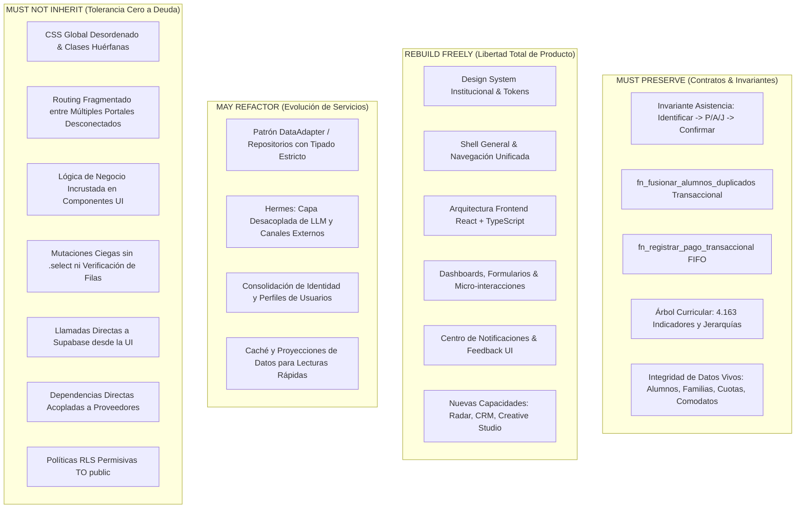

# SOI v2 INHERITANCE CONTRACT — Contrato de Evolución y Arquitectura de Producto

> **Versión del Contrato:** `v2.0-CANONICAL`  
> **Fecha:** 10 de Septiembre de 2026  
> **Ámbito:** Arquitectura & Gobernanza SOI v1 LTS $\longrightarrow$ SOI 2.0  
> **Audiencia Vinculante:** Astra, Antigravity, equipo de ingeniería y agentes ejecutores.

---

> ### 🏛️ Declaración de Principio Rector
> 
> **SOI 2.0 no es un rediseño visual de SOI v1. Es un producto nuevo construido sobre los activos verificados de v1.**

---

## 1. Filosofía Arquitectónica y Libertad de Construcción

SOI 2.0 nace para transformar la operación institucional en una experiencia fluida, moderna y reactiva impulsada por **React + TypeScript**, una arquitectura modular limpia, un Design System coherente y nuevas capacidades estratégicas (Radar, CRM, Creative Studio).

Para lograr esto sin comprometer la continuidad institucional ni encadenar al equipo a deuda técnica histórica:

1. **Desacoplamiento Total de Capas**: La interfaz de usuario, navegación, shells y componentes no están atados a las decisiones de implementación de v1. Pueden y deben ser concebidos desde cero con estándares modernos de ingeniería.
2. **Preservación Contractual, No de Código**: Lo que se preserva es el **comportamiento contractual**, las invariantes de negocio, la integridad de los datos y la ergonomía operativa que los usuarios ya dominan. No se preservan archivos, CSS, rutas hash ni plantillas HTML legacy.
3. **Principio Incondicional de Base de Datos**:
   > **SOI 2.0 no debe limpiar ni eliminar tablas al inicio. La nueva aplicación debe desacoplarse mediante repositorios/adapters. La consolidación física de la BD ocurre después de que la nueva capacidad tenga equivalencia funcional, migración verificada y rollback.**

---

## 2. El Cuadrante de Transición Técnica

```
┌────────────────────────────────────────────────────────┬────────────────────────────────────────────────────────┐
│                      MUST PRESERVE                     │                     REBUILD FREELY                     │
│  → Datos, IDs, reglas, invariantes y comportamiento     │  → UI, UX, frontend, navegación, shells, dashboards     │
│    crítico de negocio.                                 │    y arquitectura de presentación.                     │
├────────────────────────────────────────────────────────┼────────────────────────────────────────────────────────┤
│                      MAY REFACTOR                      │                    MUST NOT INHERIT                    │
│  → Lógica útil cuya implementación puede modernizarse  │  → Deuda técnica, inseguridad, legacy y                │
│    y desacoplarse de proveedores concretos.             │    acoplamientos incorrectos.                          │
└────────────────────────────────────────────────────────┴────────────────────────────────────────────────────────┘
```



---

## 3. Especificación Detallada de Categorías

### 3.1 MUST PRESERVE — Contratos e Invariantes Críticas

Se protege la lógica mental del usuario y las garantías transaccionales:

* **Ergonomía Mental de la Asistencia Docente:**
  > **Debe preservarse la ergonomía, rapidez y lógica mental del recorrido: identificar la clase del día $\longrightarrow$ abrir asistencia $\longrightarrow$ marcar P/A/J $\longrightarrow$ guardar con confirmación fiable. Las rutas, componentes, layout y diseño visual pueden reconstruirse completamente.**
* **Transaccionalidad en Caja y Finanzas:**
  - El algoritmo de cobro FIFO (`fn_registrar_pago_transaccional` o su equivalente con bloqueo pesimista) debe saldar deudas cronológicamente y acreditar excedentes a favor del estudiante.
* **Integridad en Gestión de Alumnos:**
  - La deduplicación y fusión (`fn_fusionar_alumnos_duplicados`) debe mantener atomicidad relacional sin dejar registros de asistencia o pagos huérfanos.
* **Activo Pedagógico y Curricular:**
  - La estructura y los 4.163 indicadores del árbol curricular deben preservarse como patrimonio educativo central de la institución.
* **Persistencia de Datos Vivos:**
  - Se respetan todos los IDs, UUIDs, relaciones y registros históricos de las tablas activas (`alumnos`, `familias`, `clases`, `asistencias`, `sesiones_clase`, `cuotas`, `pagos`, `inventario_activos`, `comodatos_activos`).

---

### 3.2 REBUILD FREELY — Libertad Total de Producto y Presentación

Astra y el equipo de frontend tienen plena autonomía para diseñar y programar:

* **Design System Institucional:** Tipografía, paleta de colores semántica, espaciado, elevación, iconografía y biblioteca de componentes base.
* **Shell General y Navegación:** Sustitución de los portales aislados y fragmentados por un shell unificado, responsivo, accesible y con soporte multi-rol limpio.
* **Arquitectura de Frontend:** Adopción plena de **React + TypeScript**, enrutamiento declarativo moderno (sin rutas hash `#`), manejo de estado predecible y división en capas (Container-Presentational / Deep Modules).
* **Dashboards y Vistas de Gestión:** Reimaginación visual y funcional del tablero de ausentismo, métricas institucionales, paneles de dirección y fichas de estudiante.
* **Formularios y Validación:** Experiencias de captura de datos robustas, con feedback inline, estados `loading`, `error`, `empty` y `success` deterministas.
* **Experiencia Mobile-First y Ergonomía Táctil:** Optimización para pantallas táctiles de docentes y personal operativo en aula.
* **Centro de Notificaciones y Actividad:** Feed institucional en tiempo real, claro, seguro contra inyecciones y accionable.
* **Nuevas Capacidades de SOI 2.0:** Diseño e implementación con estricto apego al Master SPEC v2.0:
  - **Radar / Inteligencia Institucional:** Detección de convocatorias externas, grants, patrocinios, alianzas, watchlists y scoring de oportunidades.
  - **CRM Institucional:** Organizaciones externas, contactos, acuerdos, compromisos y relaciones.
  - **Admisiones & Postulaciones:** Funnel de aspirantes, audiciones, becas y matrícula.
  - **Retención & Seguimiento Académico:** Detección proactiva de casos críticos y prevención del abandono escolar.
  - **Repertorio:** Catálogo de obras, particellas y seguimiento del avance técnico/orquestal.
  - **Creative Studio:** Generación de piezas gráficas multicanal (flyers, programas de mano) asistida por IA con revisión humana.

---

### 3.3 MAY REFACTOR — Modernización de Lógica y Servicios

Componentes donde la lógica de negocio es válida pero la implementación debe modernizarse:

* **Patrón DataAdapter / Repository:** Abstraer el acceso a datos en módulos profundos (*deep modules*). La UI solo consume interfaces tipadas; el adapter resuelve joins, mapeos, caché y el fallback a Modo Demo (JSON).
* **Hermes (Inteligencia y Orquestación):**
  > **Hermes: capa de integración/adaptadores de LLM y canales externos, desacoplada de proveedores concretos.**  
  Permite intercambiar backends de inferencia (Groq, OpenAI, Claude, modelos locales) y canales de mensajería (WhatsApp, Telegram, Email) mediante interfaces estandarizadas.
* **Consolidación de Identidad Institucional:** Unificación limpia del flujo de acreditación entre `auth.users`, `public.profiles` y roles funcionales (`admin`, `coordinacion`, `profesor`, `finanzas`).
* **Caché y Optimización de Consultas:** Introducción de vistas materializadas o capas de consulta rápida para aliviar la carga sobre tablas de alta frecuencia.

---

### 3.4 MUST NOT INHERIT — Deuda Técnica Prohibida

Bajo ninguna circunstancia se importará o reproducirá en SOI 2.0:

* 🚫 **CSS Global Desordenado:** Prohibido trasladar hojas de estilo monolíticas, selectores globales no encapsulados o estilos CSS-in-JS no estructurados.
* 🚫 **Routing Fragmentado:** Prohibido mantener portales desconectados con bifurcaciones de autenticación incompatibles si SOI 2.0 adopta una arquitectura de aplicación unificada.
* 🚫 **Lógica de Negocio en Componentes React:** Los componentes visuales deben ser presentacionales; la lógica de dominio reside en hooks, adaptadores o servicios especializados.
* 🚫 **Mutaciones Ciegas (Antipatrón C1):** Prohibido ejecutar mutaciones `.update()` o `.delete()` sin exigir `.select()` y validar que el conteo de filas afectadas sea mayor a cero.
* 🚫 **Llamadas Directas a Supabase desde la UI:** Cero invocaciones a `supabase.from(...)` desde componentes visuales.
* 🚫 **Dependencias Directas de Proveedor:** La lógica de la aplicación no debe acoplarse directamente a librerías propietarias de mensajería o IA sin un adaptador intermediario.
* 🚫 **Políticas RLS Permisivas:** Prohibido crear políticas `TO public USING (true)` sobre entidades que manejen PII o datos sensibles.
* 🚫 **Funciones `SECURITY DEFINER` Inseguras:** Prohibido crear RPCs privilegiadas sin revocar explícitamente permisos a `anon` y sin validar `auth.uid() IS NOT NULL`.
* 🚫 **Estados UI Implícitos o Ambiguos:** Prohibido renderizar interfaces con estados de carga infinitos, errores silenciados en la consola o variables booleanas contradictorias.
* 🚫 **Datos Duplicados Conceptualmente:** Prohibido dispersar entidades duplicadas en la UI; toda fuente divergente debe quedar consolidada detrás del adaptador correspondiente.

---

## 4. Guía de Ejecución para Astra

Cuando Astra inicie la ejecución de una historia o tarea en SOI 2.0:

1. **Revisar si toca UI/UX**: Si es presentación, **REBUILD FREELY**. Aplica las mejores prácticas de React + TypeScript y el nuevo Design System.
2. **Revisar si toca persistencia**: No borres tablas de PostgreSQL. Crea o amplía un `DataAdapter` que aísle la vista de la estructura subyacente.
3. **Revisar si toca una invariante**: Verifica que la ergonomía mental (ej: flujo de asistencia) y las garantías transaccionales (ej: pago FIFO) queden cubiertas con pruebas automatizadas (`vitest`).
4. **Revisar hygiene**: Aplica la lista de exclusión de `MUST NOT INHERIT`. Si un patrón viejo intenta colarse, córtalo de inmediato.

