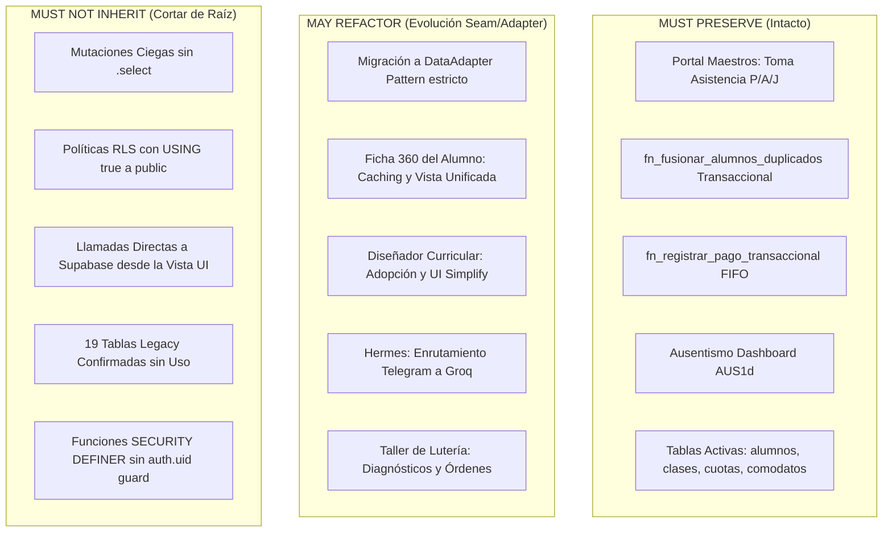

# SOI v2 INHERITANCE CONTRACT — Reglas Vinculantes de Transición Técnica

> **Fecha:** 10 de Septiembre de 2026  
> **Ámbito:** Arquitectura & Gobernanza SOI v1 LTS $\longrightarrow$ SOI 2.0  
> **Documento Canónico:** Vinculante para agentes (Astra, Antigravity, Claude) y desarrolladores.

---

## 1. Declaración de Filosofía Arquitectónica

SOI 2.0 nace sobre un sistema en producción vivo y operando con más de 340 alumnos y miles de asistencias. **No se admiten reescrituras desde cero (*rewrite from scratch*) que desechen la experiencia acumulada.**

La evolución de SOI hacia la versión 2.0 debe seguir el **Strangler Fig Pattern** (Patrón Higuera de Estrangulamiento) respetando la triple clasificación:
1. **MUST PRESERVE (No negociable)**: Núcleo probado que debe seguir funcionando de forma idéntica.
2. **MAY REFACTOR (Evolución planificada)**: Módulos funcionales que requieren desacoplamiento arquitectónico (DataAdapter, deep modules).
3. **MUST NOT INHERIT (Prohibido propagar a 2.0)**: Deuda técnica, antipatrones y código huérfano que debe morir en v1 LTS.

---

## 2. Matriz Taxonómica de Transición

### 2.1 MUST PRESERVE (Preservación Incondicional)
- **Ergonomía de Asistencia del Maestro**: El flujo `#hoy` $\rightarrow$ `#asistencia` $\rightarrow$ marcar P/A/J $\rightarrow$ Guardar no debe alterarse.
- **Transaccionalidad Atómica en Fusión y Cobro**:
  - `fn_fusionar_alumnos_duplicados`: Migración atómica de registros hijos con borrado del duplicado.
  - `fn_registrar_pago_transaccional`: Asignación FIFO de cuotas con acreditación de saldo a favor en wallet.
- **Esquema de Base de Datos Canónico**: Tablas con datos vivos (`alumnos`, `familias`, `clases`, `asistencias`, `sesiones_clase`, `cuotas`, `pagos`, `inventario_activos`, `comodatos_activos`).

### 2.2 MAY REFACTOR (Refactorización Permitida bajo Pruebas)
- **Abstracción de Persistencia**: Implementar el patrón `DataAdapter` (`src/modules/*/api/`) en todos los servicios, garantizando el funcionamiento transparente del Modo Demo (JSON).
- **Consolidación de Identidad Docente**: Sincronización transparente entre `auth.users`, `public.profiles` y `public.maestros`.
- **Integración Hermes**: Expandir la telemetría conectando `soi_eventos` con `soi_resultados_accion` (Brecha B cerrada).

### 2.3 MUST NOT INHERIT (Prohibiciones Estrictas para 2.0)
- **PROHIBIDO**: Escribir mutaciones `.update()` o `.delete()` de Supabase sin `.select()` ni validación de `affectedRows` (Antipatrón C1).
- **PROHIBIDO**: Crear políticas RLS `TO public USING (true)` sobre entidades del dominio o PII.
- **PROHIBIDO**: Crear funciones `SECURITY DEFINER` en el esquema `public` sin revocar permisos a `anon` y sin validar `auth.uid() IS NOT NULL`.
- **PROHIBIDO**: Acceder a `supabase.from(...)` directamente desde archivos `.jsx` o `.js` de vistas y componentes.
- **PROHIBIDO**: Heredar las 19 tablas `LEGACY_CONFIRMED` en el nuevo diseño relacional de SOI 2.0.

---

## 3. Cláusula de Aceptación para Agentes

Cualquier propuesta o pull request de SOI 2.0 que viole este contrato será rechazada automáticamente durante la fase de validación arquitectónica (`sdd-verify`).
