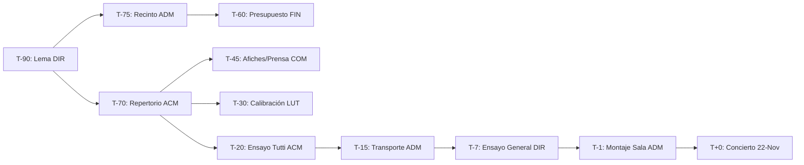

# 🏛️ ESPECIFICACIÓN TÉCNICA Y RFC ARQUITECTÓNICO (VERSION EXTENDIDA Y EXHAUSTIVA)
# MOTOR DE ORQUESTACIÓN INSTITUCIONAL, PROJECT MANAGER AUTÓNOMO Y GRAFO DE PRECEDENCIA (EVENT-DRIVEN WBS ENGINE)

**Sistema:** Sistema Operativo Institucional (SOI V9) — El Sistema Punta Cana  
**Módulo:** Motor de Orquestación de Eventos y Project Management Institucional  
**Portal Principal de Implementación:** `/admin` (Master Hub Directivo) $\longrightarrow$ **Proyección y Lente Compartida:** `/portales/calendario` y Portales Departamentales  
**Autor:** Senior Software Architect  
**Estado:** `PROPOSAL FOR MULTI-MODEL PEER REVIEW & DEBATE`  
**Stack de Ejecución:** 100% Vanilla JavaScript (ES Modules) · Vite · CSS Modular con Design Tokens · Supabase PostgreSQL (RLS) · Hermes Interdepartmental Message Bus  

---

## 1. 🎯 INTRODUCCIÓN Y FILOSOFÍA ARQUITECTÓNICA

### 1.1 El Problema Fundamental de los Calendarios Convencionales
En la mayoría de las plataformas educativas y culturales, el calendario es un **componente pasivo**: un simple almacén de fechas (`start`, `end`, `title`) que no comprende el impacto operativo de lo que registra.

Cuando una institución orquestal programa un evento de gran envergadura (por ejemplo, el **5to Aniversario de «El Sistema Punta Cana» el 22 de Noviembre**), el evento no es un "punto en el tiempo"; es un **Proyecto Complejo Multidepartamental** que requiere meses de preparación concatenada. 

La falta de inteligencia proactiva y de orquestación temporal produce fallas críticas recurrentes:
* Se olvidan los plazos de reserva de auditorios y permisos de transporte.
* El repertorio musical se define tarde, impidiendo que Comunicaciones imprima los programas de mano y que Lutería calibre los instrumentos.
* No existe un mecanismo de alerta temprana cuando una tarea crítica se atrasa a 45 días del concierto.

### 1.2 El Principio Rector: "Admin-First, Shared-to-Portals"
1. **El Portal Maestro (`/admin`) es la Fuente de la Verdad y Centro de Mando:** Aquí reside el **Motor Project Manager**, el configurador de plantillas WBS, el analizador de riesgos de Dirección y el grafo de dependencias.
2. **El Portal Calendario (`/portales/calendario`) y los Portales Departamentales (`ACM`, `ADM`, `COM`, `FIN`, `LUT`) son Lentes de Visualización y Ejecución:** Consumen los datos orquestados por el motor, permitiendo a cada departamento ver su rol dentro del macro-proyecto y reportar avances a través de Hermes.

---

## 2. 🏗️ ARQUITECTURA DEL SISTEMA Y FLUJO DE DATOS

```
┌────────────────────────────────────────────────────────────────────────────────────────────────────────┐
│                                       PORTAL ADMIN (/admin)                                            │
│   ┌────────────────────────────────────────────────────────────────────────────────────────────────┐   │
│   │                               PROJECT MANAGER CORE ENGINE                                      │   │
│   │  ┌───────────────────────┐  ┌────────────────────────┐  ┌───────────────────────────────────┐  │   │
│   │  │  WBS Temporal Engine  │  │ Precedence Graph (DAG) │  │ Bottleneck & Auto-Escalation      │  │   │
│   │  │  (T-Minus Scheduler)  │  │ Resolution Machine     │  │ Risk Daemon                       │  │   │
│   │  └──────────┬────────────┘  └───────────┬────────────┘  └─────────────────┬─────────────────┘  │   │
│   │             │                           │                                 │                    │   │
│   │  ┌──────────┴────────────┐  ┌───────────┴────────────┐  ┌─────────────────┴─────────────────┐  │   │
│   │  │ Venue Intelligence    │  │ Repertoire Feasibility │  │ Logistical Cost & Transport       │  │   │
│   │  │ Service (Punta Cana)  │  │ Curriculum Auditor     │  │ Calculator Engine                 │  │   │
│   │  └───────────────────────┘  └────────────────────────┘  └───────────────────────────────────┘  │   │
│   └─────────────────────────────────────────┬──────────────────────────────────────────────────────┘   │
└─────────────────────────────────────────────┼──────────────────────────────────────────────────────────┘
                                              ▼
┌────────────────────────────────────────────────────────────────────────────────────────────────────────┐
│                              SUPABASE POSTGRESQL (SINGLE SOURCE OF TRUTH)                              │
│   [calendario_institucional] ──< [eventos_orquestacion_wbs] ──< [tareas_institucionales (Hermes)]      │
│   [locaciones_institucionales] ──< [obras_repertorio] ──< [eventos_bitacora_pm]                        │
└─────────────────────────────────────────────┬──────────────────────────────────────────────────────────┘
                                              │
                      ┌───────────────────────┴───────────────────────┐
                      ▼                                               ▼
┌──────────────────────────────────────────┐    ┌──────────────────────────────────────────┐
│       PORTAL CALENDARIO (/calendario)    │    │    PORTALES DEPARTAMENTALES (HERMES)     │
│  - Vista FullCalendar v6 (Mes/Sem/Día)   │    │  - /portales/acm (Académico)             │
│  - Radar de Hitos T-Minus del Proyecto   │    │  - /portales/adm (Administrativo)        │
│  - Sincronización Google / Gmail (.ICS)  │    │  - /portales/com (Comunicaciones)        │
│  - Filtros Multidimensionales            │    │  - /portales/fin (Finanzas)              │
│                                          │    │  - /portales/luteria (Lutería)           │
└──────────────────────────────────────────┘    └──────────────────────────────────────────┘
```

---

## 3. 🧠 ESPECIFICACIÓN DETALLADA DE LOS 3 MODOS DE INTELIGENCIA

### 3.1 MODO ACTIVO: Generador WBS y Scheduler T-Minus
Cuando el Director crea un evento (ej. *"Gala 5to Aniversario"* para el **22 de Noviembre de 2026**), el motor ejecuta un algoritmo determinista:

$$\text{Fecha de Vencimiento de Hito}_i = \text{Fecha del Evento} - \text{T-Minus Días}_i$$

El motor descompone el evento en una **Estructura de Desglose del Trabajo (WBS)** estandarizada de 4 Fases:

```
FASE 1: CONCEPCIÓN, SCOUTING Y PRESUPUESTO (T-90 a T-60 días)
├── T-90 [DIR]: Definición de lema institucional y comisión organizadora.
├── T-75 [ADM]: Scouting, inspección técnica y reserva formal del recinto oficial.
├── T-70 [ACM]: Curaduría del repertorio musical y auditoría de particellas.
└── T-60 [FIN]: Aprobación de presupuesto maestro y cotización de sonido/luces.

FASE 2: PRODUCCIÓN, CURADURÍA Y CAMPAÑA (T-45 a T-20 días)
├── T-45 [COM]: Lanzamiento de identidad visual, programas de mano y campaña de prensa.
├── T-30 [LUT]: Calibración general de instrumentos y armado de botiquín de cuerdas.
├── T-20 [ACM]: Ensayo Tutti (Orquesta + Coro) y evaluación de madurez de las obras.
└── T-15 [ADM]: Contratación de autobuses, logística de hidratación y permisos firmados.

FASE 3: ENSAYO GENERAL, MONTAJE Y EJECUCIÓN (T-7 a T+0 días)
├── T-7  [DIR]: Ensayo acústico en sala y cierre del protocolo de autoridades.
├── T-1  [ADM/TEC]: Montaje de tarima, sillas, atriles y prueba de sonido.
└── T+0  [TODOS]: Ejecución de la Gala de 5to Aniversario.

FASE 4: AUDITORÍA POST-MORTEM Y MEMORIA (T+7 días)
└── T+7  [FIN/DIR]: Balance financiero (presupuesto vs. real), memoria gráfica y agradecimientos.
```

---

### 3.2 MODO REACTIVO: Grafo de Dependencias (DAG) y Auto-Escalamiento
El sistema no permite que las tareas se ejecuten en desorden. Implementa un **Grafo Acíclico Dirigido (DAG)** de dependencias:



#### Reglas del Grafo de Precedencia:
1. **Estado `bloqueada_por_dependencia`:** Si $T_{45}$ (Afiches COM) depende de $T_{70}$ (Repertorio ACM), la tarea de Comunicaciones aparece en el portal `COM` con un candado gris y no puede iniciarse.
2. **Desbloqueo Reactivo Automático:** En el momento exacto en que el Coordinador Académico completa el checklist de $T_{70}$, un trigger de base de datos o evento reactivo cambia el estado de $T_{45}$ a `pendiente`, enviando una notificación instantánea al portal `COM`.
3. **Detección de Cuellos de Botella y Auto-Escalamiento:**
   * Diariamente se evalúa: $\text{Atraso} = \text{Fecha Actual} - \text{Fecha Vencimiento}$.
   * Si una tarea con dependientes activos tiene $\text{Atraso} > 2\text{ días}$, el motor:
     * Eleva la prioridad a `critica`.
     * Genera una tarjeta de alerta roja en el Dashboard del Portal Admin.
     * Recomienda acciones de contingencia (ej. *"Asignar repertorio provisional para no retrasar la imprenta"*).

---

### 3.3 MODO PROACTIVO: Inteligencia Logística, Espacios y Viabilidad Musical

#### A) Directorio Inteligente de Recintos en Punta Cana
El sistema integra una base de conocimiento estructurada de los principales recintos de la zona:

```json
[
  {
    "id": "auditorio-puntacana-club",
    "nombre": "Auditorio Puntacana Club (Resort)",
    "aforo_maximo": 450,
    "tipo_acustica": "Tratada / Sala Cerrada Climatizada",
    "calidad_acustica_orquestal": 5,
    "requerimientos_logicos": [
      "Solicitud formal con 60 días de anticipación a la Fundación Puntacana",
      "Lista de cédulas y matrículas de autobuses para acceso en garita",
      "Prohibido fijar elementos en paredes de madera"
    ],
    "contacto_departamento": "ADM / DIR"
  },
  {
    "id": "centro-convenciones-barcelo",
    "nombre": "Centro de Convenciones Barceló Bávaro",
    "aforo_maximo": 1200,
    "tipo_acustica": "Gran Salón / Requiere conchas acústicas",
    "calidad_acustica_orquestal": 4,
    "requerimientos_logicos": [
      "Coordinación de montaje con 24h de antelación",
      "Plan de transporte escalonado para evitar congestión en lobby"
    ],
    "contacto_departamento": "ADM / COM"
  },
  {
    "id": "atrio-bluemall-puntacana",
    "nombre": "Atrio Central BlueMall Punta Cana",
    "aforo_maximo": 350,
    "tipo_acustica": "Abierta / Centro Comercial",
    "calidad_acustica_orquestal": 3,
    "requerimientos_logicos": [
      "Permiso de administración de plaza",
      "Horario restringido de prueba de sonido (antes de las 11:00 AM o post 7:00 PM)",
      "Ideal para metales, percusión y coro"
    ],
    "contacto_departamento": "COM / ADM"
  }
]
```

#### B) Calculadora Logística Automatizada
Al seleccionar un recinto y confirmar la nómina de alumnos participantes (ej. 110 alumnos):
$$\text{Autobuses Requeridos} = \lceil \frac{\text{Alumnos} + \text{Maestros} + \text{Staff}}{45\text{ asientos}} \rceil = \lceil \frac{110 + 12 + 8}{45} \rceil = 3\text{ autobuses}$$
$$\text{Cajas de Hidratación} = \lceil (\text{Total Personas} \times 2.5\text{ botellas}) / 24 \rceil = 14\text{ cajas}$$
El motor prellena automáticamente estos requerimientos en la orden de compra del portal `FIN` y en la hoja de ruta del portal `ADM`.

#### C) Validador de Madurez Pedagógica del Repertorio
El motor analiza las obras propuestas contra la base de datos académica:
* Consulta el nivel técnico medio de los alumnos activos en la orquesta en `public.progresos` y `public.evaluaciones`.
* Si una obra requiere nivel 4 (ej. *Obertura 1812*) y el promedio de la fila de violines es nivel 2.5, el motor emite una sugerencia proactiva:
  > *"⚠️ Advertencia Pedagógica: La fila de Segundos Violines requiere 4 semanas adicionales de ensayos seccionales para alcanzar la velocidad de tempo requerida."*

---

## 4. 🗄️ MODELO DE DATOS Y CONTRATOS SQL (SUPABASE)

### 4.1 Extensión de la Tabla de Eventos (`calendario_institucional`)
```sql
ALTER TABLE public.calendario_institucional 
ADD COLUMN IF NOT EXISTS es_macro_evento BOOLEAN DEFAULT false,
ADD COLUMN IF NOT EXISTS protocolo_tipo TEXT DEFAULT 'personalizado',
ADD COLUMN IF NOT EXISTS correlation_id TEXT,
ADD COLUMN IF NOT EXISTS salud_proyecto TEXT DEFAULT 'en_orden' CHECK (salud_proyecto IN ('en_orden', 'en_riesgo', 'critico', 'completado')),
ADD COLUMN IF NOT EXISTS venue_id TEXT,
ADD COLUMN IF NOT EXISTS aforo_proyectado INT DEFAULT 0,
ADD COLUMN IF NOT EXISTS metadata_pm JSONB DEFAULT '{}'::jsonb;
```

### 4.2 Tabla de Plantillas de Protocolos WBS (`protocolos_wbs`)
```sql
CREATE TABLE IF NOT EXISTS public.protocolos_wbs (
  id TEXT PRIMARY KEY, -- ej: 'aniversario_institucional', 'gala_navidena', 'gira_nacional'
  nombre TEXT NOT NULL,
  descripcion TEXT,
  hitos JSONB NOT NULL, -- Array de definiciones de hitos con tMinus, depto, titulo, checklist y dependencias
  created_at TIMESTAMPTZ DEFAULT now()
);
```

### 4.3 Tabla de Tareas Institucionales con Grafo DAG (`tareas_institucionales`)
```sql
CREATE TABLE IF NOT EXISTS public.tareas_institucionales (
  id UUID PRIMARY KEY DEFAULT gen_random_uuid(),
  event_id UUID REFERENCES public.calendario_institucional(id) ON DELETE CASCADE,
  correlation_id TEXT NOT NULL,
  titulo TEXT NOT NULL,
  descripcion TEXT,
  departamento TEXT NOT NULL CHECK (departamento IN ('ACM', 'ADM', 'COM', 'FIN', 'DIR', 'LUT', 'TEC')),
  estado TEXT DEFAULT 'pendiente' CHECK (estado IN ('pendiente', 'en_progreso', 'bloqueada_por_dependencia', 'completada', 'cancelada')),
  prioridad TEXT DEFAULT 'media' CHECK (prioridad IN ('baja', 'media', 'alta', 'critica')),
  fecha_vencimiento DATE NOT NULL,
  t_minus_dias INT NOT NULL,
  depende_de_tarea_id UUID REFERENCES public.tareas_institucionales(id) ON DELETE SET NULL,
  checklist JSONB DEFAULT '[]'::jsonb,
  feedback TEXT,
  created_at TIMESTAMPTZ DEFAULT now(),
  updated_at TIMESTAMPTZ DEFAULT now()
);

-- Índice para consultas de alto rendimiento por evento y departamento
CREATE INDEX IF NOT EXISTS idx_tareas_event_dept ON public.tareas_institucionales(event_id, departamento, estado);
CREATE INDEX IF NOT EXISTS idx_tareas_correlation ON public.tareas_institucionales(correlation_id);
```

### 4.4 Trigger Transaccional de Desbloqueo de Dependencias
```sql
CREATE OR REPLACE FUNCTION public.fn_trigger_desbloqueo_tareas_dependientes()
RETURNS TRIGGER AS $$
BEGIN
  -- Si una tarea pasa a estado 'completada'
  IF NEW.estado = 'completada' AND (OLD.estado IS DISTINCT FROM 'completada') THEN
    -- Desbloquear todas las tareas que dependían directamente de ella
    UPDATE public.tareas_institucionales
    SET estado = 'pendiente', updated_at = now()
    WHERE depende_de_tarea_id = NEW.id AND estado = 'bloqueada_por_dependencia';
  END IF;
  RETURN NEW;
END;
$$ LANGUAGE plpgsql;

DROP TRIGGER IF EXISTS trg_desbloqueo_tareas ON public.tareas_institucionales;
CREATE TRIGGER trg_desbloqueo_tareas
AFTER UPDATE ON public.tareas_institucionales
FOR EACH ROW EXECUTE FUNCTION public.fn_trigger_desbloqueo_tareas_dependientes();
```

---

## 5. 🛠️ CASOS BORDE, RESILIENCIA Y GESTIÓN DE EXCEPCIONES

| Caso Borde / Contingencia | Comportamiento del Motor | Mitigación Arquitectónica |
| :--- | :--- | :--- |
| **1. Desplazamiento de Fecha ($\Delta t$)** (ej. El evento se mueve del 22-Nov al 06-Dic). | El motor calcula la diferencia de días ($\Delta t = +14\text{ días}$) y actualiza en lote todas las fechas de vencimiento de las tareas **no completadas**, preservando el histórico de las ya finalizadas. | Función transaccional `fn_desplazar_cronograma_evento(event_id, delta_dias)`. |
| **2. Tarea Prerequisito Cancelada** (ej. Se decide no imprimir afiches físicos). | Al marcar la tarea como `cancelada` o `no_aplica`, el motor desbloquea automáticamente a sus dependientes para evitar que el flujo se congele. | Manejo en el trigger PL/pgSQL: `WHERE estado = 'bloqueada_por_dependencia'`. |
| **3. Tarea de Emergencia de Última Hora** (ej. Reparar un contrabajo a $T-2$). | El Director puede inyectar una tarea ad-hoc vinculada al `correlation_id` del evento con prioridad `critica` sin alterar la plantilla base. | Inserción directa en `tareas_institucionales` con `event_id`. |
| **4. Pérdida de Conexión Offline (PWA)** | El cliente almacena en caché local (IndexedDB) el estado del proyecto y sincroniza los cambios al recuperar conexión. | Adaptador `idb` existente en la PWA. |

---

## 6. 📱 DISEÑO DE INTERFAZ EN EL PORTAL ADMIN Y PORTAL CALENDARIO

### En el Portal Maestro (`/admin`):
* **Pestaña "Gestión de Proyectos Institucionales":** Muestra la lista de macro-eventos activos con su semáforo de salud (`🟢 92%`, `🟡 64%`, `🔴 35%`).
* **Modal de Mando del Evento:**
  * **Línea de Tiempo T-Minus Interactiva:** Desglose visual estilo Gantt/Checklist de las 4 fases.
  * **Radar de Departamentos:** Tarjetas individuales para `ACM`, `ADM`, `COM`, `FIN`, `LUT` con barras de progreso y lista de cuellos de botella.
  * **Selector de Recintos con Inteligencia Espacial:** Permite comparar capacidades, costos y asignar el lugar con 1-Click.

### En el Portal Calendario (`/portales/calendario`):
* **Filtro de Macro-Eventos:** Permite aislar los hitos del 5to Aniversario del resto de clases regulares.
* **Badge de Proyecto:** Los eventos orquestados lucen un distintivo dorado `[🎯 WBS Activo]`.
* **Exportación Google Calendar / Gmail:** Genera la agenda consolidada o permite suscribirse vía feed iCal en vivo.

---

## 7. 🤖 GUÍA Y PROMPT PARA EL DEBATE MULTI-MODELO (PEER REVIEW)

Copia y pega este documento íntegro en modelos como **GPT-4o, Claude 3.5 Sonnet / Opus, Gemini 1.5 Pro o DeepSeek**, acompañado del siguiente prompt de evaluación:

```text
Actúa como Arquitecto de Software Principal, Diseñador de Sistemas Event-Driven y Evaluador Crítico.
Analiza la especificación técnica (RFC) del "Motor de Orquestación Institucional y Project Manager Autónomo del SOI V9" y responde:

1. EVALUACIÓN ARQUITECTÓNICA GLOBAL:
   - ¿Es sólida y escalable la decisión de implementar este motor en el Portal Admin (/admin) proyectándolo como una lente al Portal Calendario y portales departamentales?
   - ¿Identificas cuellos de botella en la resolución de dependencias mediante triggers de PostgreSQL versus un daemon de eventos en el backend?

2. PRECISIÓN DEL MODELO TEMPORAL:
   - ¿Qué opinas del esquema T-Minus para la orquestación institucional? ¿Qué mejoras le harías al manejo de reprogramaciones y desplazamientos de fechas (Delta T)?
   - ¿Cómo manejarías la resolución de dependencias circulares accidentales en el grafo de tareas?

3. COMPARACIÓN CON HERRAMIENTAS DE MERCADO:
   - Comparado con plataformas como Asana, Jira o Monday, ¿cuál es la ventaja competitiva de tener este motor acoplado directamente al dominio pedagógico y operativo de El Sistema Punta Cana (repertorio, lutería, recintos)?

4. DICTAMEN TÉCNICO Y NOTA:
   - Señala los 3 puntos más fuertes del diseño.
   - Señala 2 posibles riesgos de implementación en JavaScript Vanilla.
   - Asigna una calificación del 1 al 10 justificando técnicamente tu nota.
```
