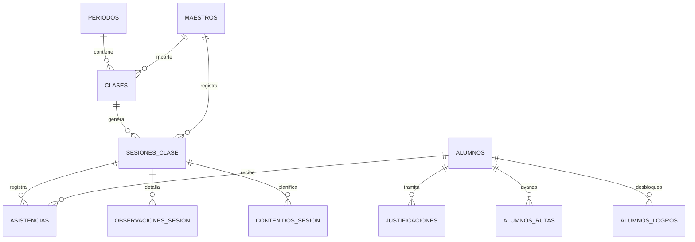

# Especificación de Arquitectura: Reportes Académicos Mensuales y Semestrales (Portal ADM · SOI)

## 1. Visión y Propósito
Este documento define la arquitectura técnica, modelo de datos, fórmulas de agregación y diseño de los informes académicos periódicos para el **Portal de Administración y Dirección (ADM)** del Sistema Operativo Institucional (SOI).

El objetivo es proveer a la Dirección y Coordinación Académica de dos herramientas clave de toma de decisiones:
1. **Informe Mensual (Táctico / Operativo):** Monitoreo de pulso, detección temprana de ausentismo y control del cumplimiento de carga docente.
2. **Informe Semestral (Estratégico / Pedagógico):** Balance de ciclo, avance curricular por cátedra, cuadro de honor de alumnos y evaluación integral de la labor docente.

---

## 2. Mapeo del Modelo de Datos (PostgreSQL / Supabase)

Las métricas se calculan a partir de las entidades nucleares del sistema:



### Entidades Involucradas:
- `periodos`: Delimita el semestre académico (`fecha_inicio`, `fecha_fin`, `estado`).
- `sesiones_clase`: Instancias de clase (`fecha`, `estado`, `clase_id`, `maestro_id`).
- `asistencias`: Estado de presencia (`presente`, `ausente`, `tarde`, `justificado`).
- `justificaciones`: Motivos y estados de inasistencias (`motivo`, `estado_aprobacion`).
- `alumnos_rutas` & `alumnos_modulos`: Avance curricular de la malla por estudiante.
- `alumnos_logros` & `indicator_attempts`: Hitos de desempeño y competencias.
- `maestros` & `maestro_tareas`: Perfiles docentes y tareas administrativas/pedagógicas.

---

## 3. Especificación del Informe Mensual

El informe mensual consolida los datos del mes calendario vencido.

### 3.1. KPIs Principales
| Métrica | Descripción | Fórmula / Fuente |
| :--- | :--- | :--- |
| **Índice de Asistencia Global** | % de asistencia real sobre el total de convocatorias | $\frac{\text{Presentes} + \text{Tardes}}{\text{Total Registros}} \times 100$ |
| **Ratio de Justificación** | % de ausencias formalmente notificadas | $\frac{\text{Ausencias con Justificación}}{\text{Total Ausencias}} \times 100$ |
| **SLA de Registro Docente** | Horas promedio transcurridas hasta el cierre de sesión | $\text{AVG}(\text{sesiones.updated\_at} - \text{sesiones.hora\_fin})$ |
| **Efectividad del Calendario** | Clases dictadas vs. programadas | $\frac{\text{Sesiones Realizadas}}{\text{Sesiones Programadas}} \times 100$ |

### 3.2. Secciones del Reporte Mensual
1. **Patrón Semanal de Concurrencia:**
   - **Día Pico:** Día de la semana con mayor tasa de presencia ($% \max$).
   - **Día Valle:** Día de la semana con mayor tasa de inasistencia ($% \min$).
   - Heatmap de asistencia: Cruce día de semana $\times$ bloque horario.
2. **Alerta Temprana de Alumnos en Riesgo:**
   - Listado de alumnos con $\ge 2$ ausencias en el mes.
   - Desglose: Alumno, Cátedra/Instrumento, Maestro, Teléfono del Representante, Conteo de Ausencias Injustificadas.
3. **Semáforo de Cumplimiento Docente:**
   - % de sesiones en estado `asistencia_registrada` / `cerrada` dentro de las primeras 24 horas.
   - Backlog de sesiones en `pendiente` / `abierta` / `atrasada`.
   - Ratio de riqueza pedagógica: % de sesiones con `observaciones_sesion` o tareas cargadas.

---

## 4. Especificación del Informe Semestral

El informe semestral provee un análisis longitudinal y de cierre de período lectivo.

### 4.1. Análisis Longitudinal de Asistencia y Retención
- **Curva Temporal Mensual:** Evolución del % de asistencia mes a mes a lo largo del semestre (identifica meses críticos de abandono).
- **Cuadro de Honor de Asistencia:** Alumnos con $100\%$ de asistencia o $\ge 95\%$.
- **Ranking de Ausentismo & Causas Raíz:**
  - Top 10 alumnos con más inasistencias en el semestre.
  - Distribución de motivos de inasistencia desde `justificaciones` (Salud, Transporte, Académico escolar, Personal).
- **Tasa de Retención por Cátedra:**
  $$\text{Retención Cátedra} = \frac{\text{Alumnos Activos al Cierre}}{\text{Alumnos Inscritos al Inicio}} \times 100$$

### 4.2. Progreso Curricular y Rendimiento
- **Alumnos Destacados (Merit Score):** Algoritmo de ponderación para identificar estudiantes de alto desempeño:
  $$\text{Score} = (0.4 \times \text{\% Asistencia}) + (0.3 \times \text{Logros Desbloqueados}) + (0.3 \times \text{\% Indicadores Aprobados})$$
- **Velocidad de Avance Curricular:**
  - % promedio de avance en `alumnos_rutas` por cátedra.
  - Alumnos que completaron su nivel y están listos para promoción.
- **Cobertura Curricular Efectiva:** Comparación de temas planificados en `plan_clases` vs. temas registrados en `contenidos_sesion`.

### 4.3. Evaluación Consolidada del Desempeño Docente
Matriz de Evaluación Docente (1 al 100):
1. **Solvencia Administrativa (40%):** Puntualidad de carga de asistencia, cero sesiones en mora.
2. **Retención de Cátedra (30%):** Tasa de permanencia de sus alumnos en el semestre.
3. **Seguimiento Pedagógico (20%):** Consistencia en notas cualitativas, registro de observaciones y retroalimentación.
4. **Recuperación de Clases (10%):** Ratio de clases canceladas que fueron efectivamente reprogramadas y dictadas.

---

## 5. Arquitectura Técnica de Implementación

### 5.1. Capa de Base de Datos y Vistas Materializadas
Para evitar consultas lentas que recorran millones de registros en tiempo de ejecución, se implementan Vistas / RPCs optimizadas en Supabase:

```sql
-- RPC: Resumen Mensual Académico
CREATE OR REPLACE FUNCTION get_resumen_academico_mensual(
  p_periodo_id UUID,
  p_mes INT,
  p_anio INT
)
RETURNS JSONB
LANGUAGE plpgsql
SECURITY DEFINER
AS $$
-- Agregación de asistencias, días picos, alertas de riesgo y cumplimiento docente
$$;

-- RPC: Informe Semestral Consolidado
CREATE OR REPLACE FUNCTION get_informe_academico_semestral(
  p_periodo_id UUID
)
RETURNS JSONB
LANGUAGE plpgsql
SECURITY DEFINER
AS $$
-- Agregación longitudinal, retención, merit score y evaluación docente
$$;
```

### 5.2. Pipeline de Visualización y Exportación en Frontend
- **Ubicación en UI:** Submódulo en Portal ADM:
  - Ruta: `operacion/reporte-cierre` y nueva pestaña `operacion/reportes-academicos`.
- **Motor de Renderizado:**
  - Visualización interactiva en pantalla con componentes web modulares.
  - Exportación estructurada a PDF utilizando `jspdf` + `jspdf-autotable`.
  - Exportación a Excel (`xlsx`) para auditoría y archivo institucional.

### 5.3. Seguridad y Políticas RLS
- **Acceso:** Roles autorizados: `admin`, `director_academico`, `coordinador_academico`.
- **Restricción:** Maestros y representantes solo pueden ver los extractos individuales que les corresponden, nunca el informe institucional consolidado.
