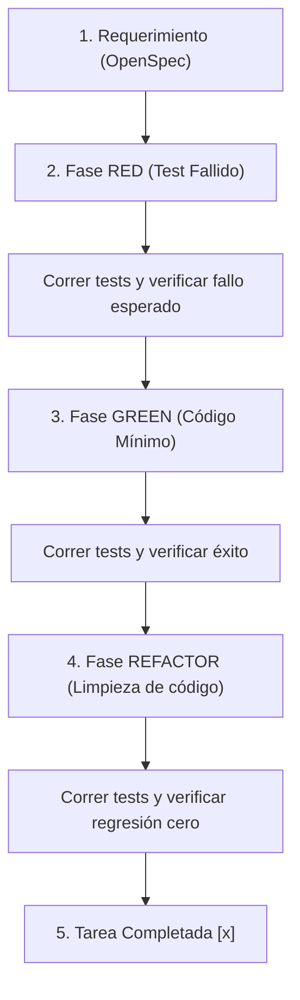

# Manual Operativo de Test-Driven Development (TDD Estricto)
**Proyecto**: Sistema Académico PWA (sistema-academico-pwa)  
**SSoT Regulatoria**: Normas de Calidad de Software de El Sistema Punta Cana  

---

## 1. PROPÓSITO Y CONTRATO

Este documento define la norma y el estándar técnico obligatorio para la implementación de software en este repositorio. Cuando la regla `strict_tdd: true` esté configurada en [openspec/config.yaml](file:///C:/Users/omare/OneDrive/Documentos/SOI_Sistema_Operativo_Institucional/09_SOI_WEB_PORTAL/sistema-academico-pwa/openspec/config.yaml), todos los desarrolladores y agentes de IA MUST seguir este manual operativo sin excepciones. 

---

## 2. EL CICLO DE DESARROLLO TDD ESTRICTO

El ciclo de desarrollo en este proyecto sigue estrictamente el patrón **RED → GREEN → REFACTOR**:

### 2.1 Fase RED (Fase Roja)
*   **Acción**: Escribir una o más pruebas unitarias/de integración que describan el comportamiento esperado del escenario de especificación *antes* de escribir cualquier código de producción.
*   **Verificación**: Ejecutar la suite de pruebas de ese módulo específico y confirmar que **falla**. 
*   *Nota*: Si la prueba pasa en este punto, significa que la funcionalidad ya existe o que la prueba está mal diseñada (falso positivo).

### 2.2 Fase GREEN (Fase Verde)
*   **Acción**: Escribir la cantidad **mínima** de código en el archivo de producción necesaria para que la prueba pase.
*   **Verificación**: Ejecutar la prueba y confirmar que pasa en **verde**. 
*   *Restricción*: Queda prohibido añadir funcionalidades o lógica adicional que no esté expresamente cubierta por la prueba escrita en la Fase RED.

### 2.3 Fase REFACTOR (Fase de Refactorización)
*   **Acción**: Limpiar y optimizar la base de código. Eliminar duplicidades, simplificar condicionales, mejorar la legibilidad y estructurar el diseño de acuerdo con los patrones de arquitectura limpia y SOLID.
*   **Verificación**: Ejecutar la suite de pruebas nuevamente y confirmar que todo se mantiene en **verde**.

---

## 3. ESTÁNDARES TÉCNICOS ESPECÍFICOS DEL PROYECTO

### 3.1 Aislamiento de DOM en Pruebas de Interfaz (Vanilla JS)
Dado que el proyecto utiliza JavaScript Vanilla y Bootstrap 5 sin frameworks reactivos de UI, las pruebas interactúan directamente con el DOM simulado por `jsdom`:

*   **Evitar Selectores Globales**: Queda prohibido el uso de selectores de ámbito global como `document.getElementById` o `document.querySelectorAll` para adjuntar eventos u obtener referencias en los tests.
*   **Scoping Obligatorio**: Todas las búsquedas de elementos en producción y pruebas MUST realizarse a nivel de contenedor utilizando `container.querySelector` o `container.querySelectorAll` dentro de las funciones de inicialización. Esto asegura el aislamiento de la vista y previene colisiones en la SPA.

### 3.2 Aislamiento de Acceso a Datos (DataAdapter Pattern)
Para garantizar la resiliencia offline de la PWA y permitir demostraciones sin conexión de base de datos:

*   **Fachadas de API**: Los módulos de datos deben implementar un adaptador (`*Adapter.js` o `*Api.js`) que actúe como un despachador.
*   **Comportamiento Dinámico**: Si `config.isDemoMode` es `true`, la fachada debe invocar una implementación Mock local respaldada por IndexedDB/localStorage (`*Mock.js`). Si es `false`, debe invocar la implementación real de Supabase (`*Supabase.js`).
*   **Paridad de Forma (Shape Parity)**: Las pruebas unitarias deben validar que ambas implementaciones (Supabase y Mock) retornen objetos estructurados idénticos para evitar fallos en tiempo de ejecución en la capa de vista.

### 3.3 Calidad de las Pruebas (Evitar el Antipatrón de Aserción Estructural)

> [!CAUTION]
> **Antipatrón de Test**: No escribir pruebas que lean archivos físicos como texto plano (mediante `fs.readFileSync`) para comprobar la sintaxis interna del código (e.g. buscar la cadena literal `function nombreFuncion`).

*   **Por qué se prohíbe**: Las aserciones sobre cadenas de texto del código fuente son sumamente frágiles. Rompen el ciclo de refactorización cuando se cambian nombres de variables privadas, se migra a arrow functions o se reformatea el código con Prettier/ESLint, a pesar de que el software funciona perfectamente.
*   **Estándar Correcto**: Las pruebas unitarias deben evaluar el **comportamiento y estado público** de las funciones expuestas, o el estado resultante en el DOM renderizado (caja negra).

---

## 4. COMANDOS DE EJECUCIÓN

*   **Ejecución Completa**: `npm run test:run` (corre Vitest una sola vez para la CI y pre-commit).
*   **Modo Observador (Desarrollo)**: `npm run test` (Vitest en modo watch, ideal para el ciclo RED-GREEN de TDD).
