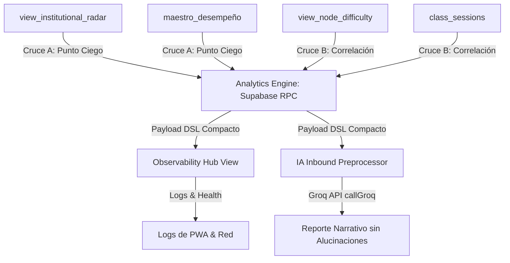

# 01. Exploración Técnica: Observability & Analytics Hub

> [!NOTE]
> **Decisión Ejecutiva:** Se establece el uso del backend **`openspec`** en el sistema local para asegurar la máxima trazabilidad en el control de cambios de Git, dado que el servidor externo Engram presenta restricciones de permisos en esta terminal.

Este documento detalla la exploración y mapeo del sistema para la convergencia del nuevo módulo de **Análisis (Observability & Analytics Hub)** en el Portal Administrador. 

---

## 🧭 1. Mapeo de Componentes del Sistema

El módulo de "Análisis" actual se encuentra fragmentado en la UI y en la base de datos. Para converger el sistema, debemos unificar los siguientes componentes:

### 🖥️ A. Componentes de UI (Frontend PWA)
*   **`src/modules/metricas/views/dashboardMetricasView.js`**: Vista actual de métricas institucionales con pestañas para *Resumen*, *Alertas* (Académicas), *Riesgo* (Académico) y un placeholder de *IA Analysis*.
*   **`src/modules/admin-dashboard/views/cumplimientoMaestrosWidget.js`**: Widget independiente que renderiza el listado de maestros, su categoría de cumplimiento y registros atrasados de asistencia.
*   **`src/modules/admin-dashboard/views/analyticsFillingBehaviorWidget.js`**: Widget que calcula analíticas de velocidad de registro de asistencia de maestros.
*   **`src/modules/admin-dashboard/views/directorTrendReportView.js`**: Reporte de tendencias operativas de la escuela.
*   **`src/modules/metricas/views/iaReporteGeneradorView.js`**: Generador de boletines de IA y programador de envíos por correo.

### 💾 B. Esquema de Datos en Supabase (Backend)
Analizando las migraciones y esquemas, identificamos las siguientes fuentes estructuradas listas para ser explotadas:

| Recurso en Supabase | Tipo | Datos Clave que Provee | Propósito Analítico |
| :--- | :--- | :--- | :--- |
| `public.view_institutional_radar` | Vista SQL | `health_status` ('active', 'stagnant', 'not_started'), `days_inactive`, `approved_nodes`, `progress_percentage`. | Identificar deserción escolar y estancamiento pedagógico. |
| `public.view_node_difficulty` | Vista SQL | `failed_attempts`, `failure_percentage`, `total_attempts` agrupado por nodo curricular e instrumento. | Identificar cuellos de botella del currículum de música. |
| `public.maestro_desempeño` | Tabla | `categoria` ('responsable', 'regular', 'incumplidor', 'negligente'), contadores de atraso (`sesiones_rojo`, `sesiones_amarillo`). | Medir la disciplina del cuerpo docente en la app. |
| `public.ausencias_auditoria` | Tabla | Log de transacciones y estados de ausencias (`accion`, `usuario_id`, `created_at`). | Trazabilidad y auditoría de seguridad del portal. |

---

## 🔄 2. Arquitectura de Convergencia: El Cruce de Datos

La convergencia de datos se realizará en la base de datos (mediante SQL/Supabase RPC) y se pre-procesará en un formato simplificado antes de interactuar con la interfaz del cliente o la IA.



### ⚡ Cruce A: Detección de "Punto Ciego Analítico" (Operativo ➔ Académico)
*   **El Problema:** Alumnos clasificados como `active` en `view_institutional_radar` pero que asisten a clases con maestros en categoría `negligente` o `incumplidor` (que tienen alta acumulación de `sesiones_rojo` en `maestro_desempeño`). Estos alumnos corren riesgo de deserción no capturada porque el docente no sube las asistencias a tiempo.
*   **La Solución:** Crear un indicador cruzado en el backend que califique a cada sección con un **"Riesgo por Silencio de Datos"** (Score del 1 al 100), alertando al director de que "No podemos garantizar el seguimiento en el Salón X debido a fallas de registro docente".

### 🎓 Cruce B: Correlación Pedagógica-Docente (Curricular ➔ Docencia)
*   **El Problema:** Un nodo con alta tasa de intentos fallidos en `view_node_difficulty` puede deberse a que el plan de estudios está mal diseñado, o a problemas en la metodología del docente que imparte ese instrumento.
*   **La Solución:** Realizar una correlación cruzada de `view_node_difficulty` filtrada por `maestro_id`. Si la desviación estándar entre maestros es alta, el Hub marcará el nodo como **"Alerta Metodológica Docente"**; si es homogénea en todos los maestros, se marcará como **"Alerta Curricular Directa"**.

---

## 🤖 3. El Motor de IA: Generador Narrativo mediante DSL

Para garantizar que el uso de IA sea rentable, libre de alucinaciones matemáticas y sumamente rápido, diseñamos un pipeline de pre-procesamiento de datos:

1.  **Pre-procesador de Datos (SQL/JS):** En lugar de mandarle a la IA un listado gigante de alumnos y maestros, una función API agrupa los datos analíticos cruzados en un **Payload DSL estructurado** (un JSON resumido de apenas 15-20 líneas con los puntos críticos).
2.  **Groq Inbound Call (`callGroq`):** Se le envía este payload de datos limpios a la API de Groq con un prompt de sistema rígido.
3.  **Generación de Recomendaciones:** El modelo actúa únicamente como un "Redactor de Síntesis y Planes de Acción". Al no tener que hacer matemáticas, el reporte final mantiene una precisión del 100%.

### 📝 Ejemplo de Payload DSL Pre-procesado
```json
{
  "periodo": "Mayo 2026",
  "institucional": { "salud_general": "regular", "alumnos_stagnant": 12 },
  "alertas_docentes": [
    { "maestro": "Carlos Gómez", "instrumento": "Violín", "categoria": "negligente", "sesiones_retrasadas": 8 }
  ],
  "hotspots_aprendizaje": [
    { "nodo": "Posición de Mano Izquierda (Violín)", "tasa_fallo_global": 75, "correlacion_docente": "Alta concentración en el grupo de Carlos Gómez (90% fallos)" }
  ]
}
```

---

## 🛡️ 4. Análisis de Riesgos y Mitigación

*   **Riesgo 1: Pérdida de conectividad en el cliente (PWA Offline).**
    *   *Mitigación:* La suite de observabilidad guardará los logs de eventos técnicos locales en la IndexedDB del cliente y los sincronizará en batch cuando el estado de red pase a `online`.
*   **Riesgo 2: Tiempos de carga lentos por consultas SQL pesadas.**
    *   *Mitigación:* Las vistas analíticas de Supabase se materializarán o se consultarán utilizando rangos de fecha estrictamente acotados ( rolling 4-week window) para evitar escaneos de tabla completa.
*   **Riesgo 3: Alucinaciones del LLM en el reporte de IA.**
    *   *Mitigación:* Se implementa un validador de consistencia en JS después de recibir la respuesta de Groq, comparando los nombres y cifras citadas por la IA con el payload DSL original.
